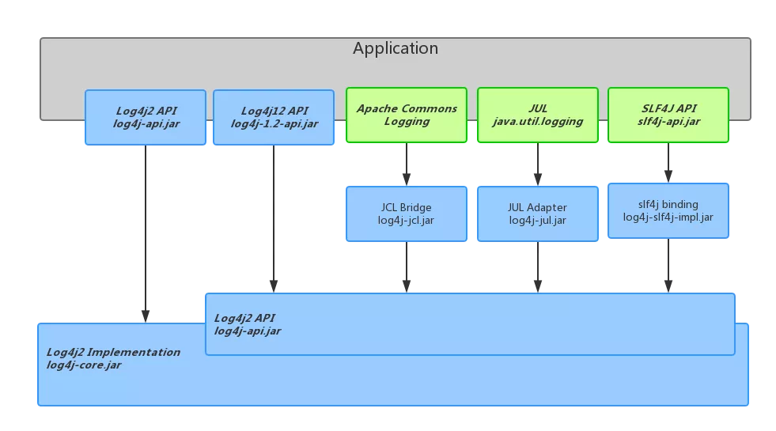
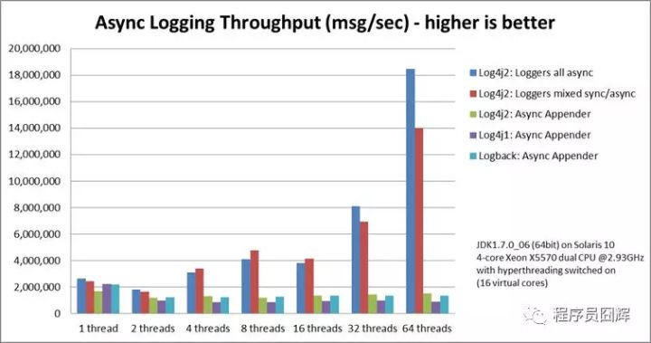
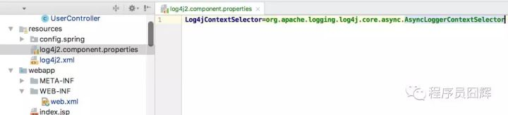
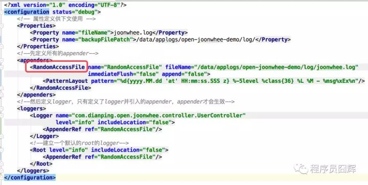
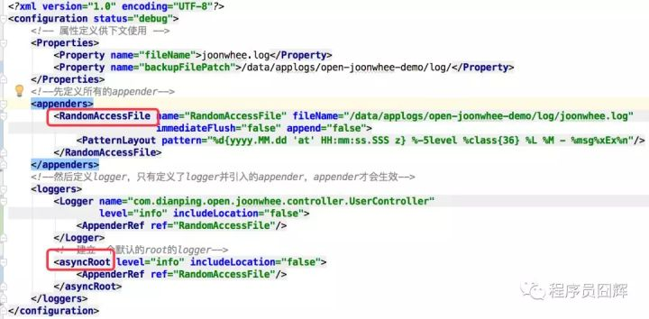

# 日志框架的历史

## 一、日志框架的分类

  - 门面型日志框架：

  1. JCL：　　Apache基金会所属的项目，是一套Java日志接口，之前叫Jakarta Commons Logging，后更名为Commons Logging
  2. SLF4J：  是一套简易Java日志门面，**本身并无日志的实现**。（Simple Logging Facade for Java，缩写Slf4j）

  - 记录型日志框架:

  1. JUL：　　JDK中的日志记录工具，也常称为JDKLog、jdk-logging，自Java1.4以来的官方日志实现。
  2. Log4j：　 一个具体的日志实现框架。
  3. Log4j2：  一个具体的日志实现框架，是LOG4J1的下一个版本，与Log4j 1发生了很大的变化，Log4j 2不兼容Log4j 1。
  4. Logback：一个具体的日志实现框架，和Slf4j是同一个作者，但其性能更好。

  　　　　　　　　　　　　　　

## 二、发展历程

要搞清楚它们的关系，就要从它们是在什么情况下产生的说起。我们按照时间的先后顺序来介绍。

### Log4j

  在JDK 1.3及以前，Java打日志依赖System.out.println(), System.err.println()或者e.printStackTrace()，Debug日志被写到STDOUT流，错误日志被写到STDERR流。这样打日志有一个非常大的缺陷，即无法定制化，且日志粒度不够细。
  于是， Gülcü 于2001年发布了Log4j，后来成为Apache 基金会的顶级项目。Log4j 在设计上非常优秀，对后续的 Java Log 框架有长久而深远的影响，它定义的Logger、Appender、Level等概念如今已经被广泛使用。Log4j 的短板在于性能，在Logback 和 Log4j2 出来之后，Log4j的使用也减少了。

Log4j是Apache的一个开放源代码项目，通过使用Log4j，我们可以控制日志信息输送的目的地是控制台、文件、数据库等；我们也可以控制每一条日志的输出格式；通过定义每一条日志信息的级别，我们能够更加细致地控制日志的生成过程。

Log4j有7种不同的log级别，按照等级从低到高依次为：TRACE、DEBUG、INFO、WARN、ERROR、FATAL、OFF。如果配置为OFF级别，表示关闭log。Log4j支持两种格式的配置文件：properties和xml。包含三个主要的组件：Logger、appender、Layout。

如果在我们系统中单独使用log4j的话，我们只需要引入log4j的核心包就可以了，我这里用的是：log4j-1.2.17.jar，然后在系统中使用如下代码输出日志：

`private static final org.apache.log4j.Logger logger = org.apache.log4j.Logger.getLogger(Log4jTest.class);`

### Log4j2

  现在有了更好的 SLF4J 和 Logback，慢慢取代JCL 和 Log4j ，事情到这里总该大统一圆满结束了吧。然而维护 Log4j 的人不这样想，他们不想坐视用户一点点被 SLF4J / Logback 蚕食，继而搞出了 Log4j2。

  Log4j2 和 Log4j1.x 并不兼容，设计上很大程度上模仿了 SLF4J/Logback，性能上也获得了很大的提升。Log4j2 也做了 Facade/Implementation 分离的设计，分成了 log4j-api 和 log4j-core。

  现在好了，我们有了三个流行的Log 接口和四个流行的Log实现，如果画出桥接关系的图来回事什么样子呢?

  　　　　　　　　　　　　
  看到这里是不是感觉有点晕呢？是的，我也有这种感觉。同样，在添加依赖的时候，要小心不要有循环依赖。

如果在我们系统中单独使用log4j2的话，我们只需要引入log4j2的核心包就可以了，我这里用的是：log4j-api-2.7.jar和log4j-core-2.7.jar，然后在系统中使用如下代码输出日志：

`private static org.apache.logging.log4j.Logger logger = org.apache.logging.log4j.LogManager.getLogger(Log4jTest.class);`

 在系统的src目录下添加依赖的配置文件。

>log4j与log4j2的区别：
>
>1. 获取Logger的api不一样，log4j的api为org.apache.log4j.Logger，而log4j2的api为org.apache.logging.log4j.Logger
>2. 配置方式不一样，log4j2对properties的配置支持不是很好，它的格式一般为xml格式或者yaml格式，这种格式的可读性比较好，各种配置一目了然
>3. Log4j2.0基于LMAX Disruptor的异步日志在多线程环境下性能会远远优于Log4j 1.x和logback（官方数据是10倍以上）。
### J.U.L

受Logj启发，Sun在Java1.4版本中引入了java.util.logging，但是j.u.l功能远不如log4j完善，开发者需要自己编写Appenders（Sun称之为Handlers），且只有两个Handlers可用（Console和File），j.u.l在Java1.5以后性能和可用性才有所提升。

JUL 全称 java.util.logging.Logger，JDK 自带的日志系统，从 JDK1.4 就有了。因为 log4j 的存在，这个 logger 一直沉默着，其实在一些测试性的代码中，jdk 自带的 logger 比 log4j 更方便。JUL 是自带具体实现的，与 log4j、logback 等类似，而不是像 JCL、slf4j 那样的日志接口封装。

```
import java.util.logging.Level;
import java.util.logging.Logger;

private static final Logger LOGGER = Logger.getLogger(MyClass.class.getName());
```

- 相同名字的 Logger 对象全局只有一个；
- 一般使用圆点分隔的层次命名空间来命名 Logger；Logger 名称可以是任意的字符串，但是它们一般应该基于被记录组件的包名或类名，如 java.net 或 javax.swing；
- 配置文件默认使用 jre/lib/logging.properties，日志级别默认为 INFO；
- 可以通过系统属性 java.util.logging.config.file 指定路径覆盖系统默认文件；
- 日志级别由高到低依次为：SEVERE（严重）、WARNING（警告）、INFO（信息）、CONFIG（配置）、FINE（详细）、FINER（较详细）、FINEST（非常详细）。另外还有两个全局开关：OFF「关闭日志记录」和 ALL「启用所有消息日志记录」。
- 《logging.properties》文件中，默认日志级别可以通过.level= ALL 来控制，也可以基于层次命名空间来控制，按照 Logger 名字进行前缀匹配，匹配度最高的优先采用；日志级别只认大写；
- JUL 通过 handler 来完成实际的日志输出，可以通过配置文件指定一个或者多个 hanlder，多个 handler 之间使用逗号分隔；handler 上也有一个日志级别，作为该 handler 可以接收的日志最低级别，低于该级别的日志，将不进行实际的输出；handler 上可以绑定日志格式化器，比如 java.util.logging.ConsoleHandler 就是使用的 String.format 来支持的；

配置文件示例：

```
handlers= java.util.logging.ConsoleHandler

.level= ALL
com.suian.logger.jul.xxx.level = CONFIG
com.suian.logger.jul.xxx.demo2.level = FINE
com.suian.logger.jul.xxx.demo3.level = FINER

java.util.logging.ConsoleHandler.level = ALL
java.util.logging.ConsoleHandler.formatter = java.util.logging.SimpleFormatter
java.util.logging.SimpleFormatter.format=%1$tF %1$tT [%4$s] %3$s -  %5$s %n
```

http://logging.apache.org/log4j/2.x/manual/configuration.html

### JCL（commons-logging）

  由于项目的日志打印必然选择两个框架中至少一个，这时候，Apache的JCL（commons-logging）诞生了。JCL 是一个Log Facade，只提供 Log API，不提供实现，然后有 Adapter 来使用 Log4j 或者 JUL 作为Log Implementation。
  在程序中日志创建和记录都是用JCL中的接口，在真正运行时，会看当前ClassPath中有什么实现，如果有Log4j 就是用 Log4j, 如果啥都没有就是用 JDK 的 JUL。
  这样，在你的项目中，还有第三方的项目中，大家记录日志都使用 JCL 的接口，然后最终运行程序时，可以按照自己的需求(或者喜好)来选择使用合适的Log Implementation。如果用Log4j, 就添加 Log4j 的jar包进去，然后写一个 Log4j 的配置文件；如果喜欢用JUL，就只需要写个 JUL 的配置文件。如果有其他的新的日志库出现，也只需要它提供一个Adapter，运行的时候把这个日志库的 jar 包加进去。
  不过，commons-logging对Log4j和j.u.l的配置问题兼容的并不好，使用commons-loggings还可能会遇到类加载问题，导致NoClassDefFoundError的错误出现。

  　　　　　　　　　　　　　　　　　　　　　　　　

  到这个时候一切看起来都很简单，很美好。接口和实现做了良好的分离，在统一的JCL之下，不改变任何代码，就可以通过配置就换用功能更强大，或者性能更好的日志库实现。

之前叫Jakarta Commons Logging，简称JCL，是Apache提供的一个通用日志API，可以让应用程序不再依赖于具体的日志实现工具。

commons-logging包中对其它一些日志工具，包括Log4J、Avalon LogKit、JUL等，进行了简单的包装，可以让应用程序在运行时，直接将JCL API打点的日志适配到对应的日志实现工具中。

common-logging通过动态查找的机制，在程序运行时自动找出真正使用的日志库。这一点与slf4j不同，slf4j是在编译时静态绑定真正的Log实现库。

commons-logging包里的包装类和简单实现列举如下：

- org.apache.commons.logging.impl.Jdk14Logger，适配JDK1.4里的JUL；
- org.apache.commons.logging.impl.Log4JLogger，适配Log4J；
- org.apache.commons.logging.impl.LogKitLogger，适配avalon-Logkit；
- org.apache.commons.logging.impl.SimpleLog，common-logging自带日志实现类，它实现了Log接口，把日志消息都输出到系统错误流System.err中；
- org.apache.commons.logging.impl.NoOpLog，common-logging自带日志实现类，它实现了Log接口，其输出日志的方法中不进行任何操作；

如果只引入Apache Commons Logging，也没有通过配置文件《commons-logging.properties》进行适配器绑定，也没有通过系统属性或者SPI重新定义LogFactory实现，默认使用的就是jdk自带的java.util.logging.Logger来进行日志输出。

JCL使用配置文件commons-logging.properties，可以在该文件中指定具体使用哪个日志工具。不配置的话，默认会使用JUL来输出日志。

  这种简单美好一直持续到SLF4J出现。

### SLF4J 

 SLF4J（Simple Logging Facade for Java）和 Logback 也是Gülcü 创立的项目，目的是为了提供更高性能的实现。
  从设计模式的角度说，SLF4J 是用来在log和代码层之间起到门面作用，类似于 JCL 的 Log Facade。对于用户来说只要使用SLF4J提供的接口，即可隐藏日志的具体实现，SLF4J提供的核心API是一些接口和一个LoggerFactory的工厂类，用户只需按照它提供的统一纪录日志接口，最终日志的格式、纪录级别、输出方式等可通过具体日志系统的配置来实现，因此可以灵活的切换日志系统。

LF4J全称The Simple Logging Facade for Java，简单日志门面，这个不是具体的日志解决方案，而是通过门面模式提供一些Java Logging API，类似于JCL。题外话，作者当时创建SLF4J的目的就是为了替代Jakarta Commons Logging（JCL）。

SLF4J提供的核心API是一些接口以及一个LoggerFactory的工厂类。在使用SLF4J的时候，不需要在代码中或配置文件中指定你打算使用哪个具体的日志系统，可以在部署的时候不修改任何配置即可接入一种日志实现方案，在编译时静态绑定真正的Log库。

使用SLF4J时，如果你需要使用某一种日志实现，那么你必须选择正确的SLF4J的jar包的集合（各种桥接包）。SLF4J提供了统一的记录日志的接口，只要按照其提供的方法记录即可，最终日志的格式、记录级别、输出方式等通过具体日志系统的配置来实现，因此可以在应用中灵活切换日志系统。

因此单独的slf4j是不能工作的，它必须搭配其他具体的日志实现方案，比如**apache**的**org.apache.log4j.Logger**，jdk自带的**java.util.logging.Logger**等等。

其中对与jar包：

　　　　slf4j-log4j12-x.x.x.jar是使用org.apache.log4j.Logger提供的驱动

　　　　slf4j-jdk14-x.x.x.jar是使用java.util.logging提供的驱动

　　　　slf4j-simple-x.x.x.jar直接绑定System.err

　　　　slf4j-jcl-x.x.x.jar是使用commons-logging提供的驱动

　　　　logback-classic-x.x.x.jar是使用logback提供的驱动

slf4j仅仅是一个为Java程序提供日志输出的统一接口，并不是一个具体的日志实现方案，就比如JDBC一样，只是一种规则而已，所以单独的slf4j是不能工作的，必须搭配其他具体的日志实现方案，比如log4j或者log4j2，要在系统中使用slf4j，我们需要引入的核心包为：slf4j-api-1.6.4.jar。

如果不想每次都写private final Logger logger = LoggerFactory.getLogger(XXX.class); 可以在方法前用注解@Slf4j，然后直接使用log.info去打印日志。如果注解@Slf4j注入后找不到变量log，那就给IDE安装lombok插件（idea中：1、File  → settings →  Plugins,  然后点击“Browse repositories”；2、输入 lombok 搜索插件， 点install安装，安装完重启idea）。

###  Logback

logback是slf4j-api的天然实现，不需要桥接包就可以使用。另外slf4j还封装了很多其他的桥接包，可以使用到其他的日志实现中，比如slf4j-log4j12，就可以使用log4j进行底层日志输出，再比如slf4j-jdk14，可以使用JUL进行日志输出。

Logback，一个“可靠、通用、快速而又灵活的Java日志框架”。Logback当前分成三个模块：logback-core，logback- classic和logback-access。logback-core是其它两个模块的基础模块。logback-classic是log4j的一个改良版本，完整实现了SLF4J API。

logback-access模块与Servlet容器集成提供通过Http来访问日志的功能。Logback依赖配置文件logback.xml，当然也支持groovy方式。Logback相比log4j，有很多很多的优点，网上一搜一大片，此处就不再赘述了。

  Logback是log4j的升级版，当前分为三个目标模块：

  - logback-core：核心模块，是其它两个模块的基础模块
  - logback-classic：是log4j的一个改良版本，同时完整实现 SLF4J API 使你可以很方便地更换成其它日记系统如log4j 或 JDK14 Logging
  - logback-access：访问模块与Servlet容器集成提供通过Http来访问日记的功能，是logback不可或缺的组成部分

  Logback相较于log4j有更多的优点：

  - 更快的执行速度
  - 更充分的测试
  - logback-classic 非常自然的实现了SLF4J
  - 使用XML配置文件或者Groovy
  - 自动重新载入配置文件
  - 优雅地从I/O错误中恢复
  - 自动清除旧的日志归档文件
  - 自动压缩归档日志文件
  - 谨慎模式
  - Lilith
  - 配置文件中的条件处理
  - 更丰富的过滤

  更详细的解释参见官网：[https://logback.qos.ch/reasonsToSwitch.html](https://yq.aliyun.com/go/articleRenderRedirect?url=https%3A%2F%2Flink.jianshu.com%2F%3Ft%3Dhttps%3A%2F%2Flogback.qos.ch%2FreasonsToSwitch.html)

  到这里，你可能会问：Apache 已经有了个JCL，用来做各种Log lib统一的接口，如果 Gülcü 要搞一个更好的 Log 实现的话，直接写一个实现就好了，为啥还要搞一个和SLF4J呢?

  原因是Gülcü 认为 JCL 的 API 设计得不好，容易让使用者写出性能有问题的代码。关于这点，你可以参考这篇文章获得更详细的介绍：[https://zhuanlan.zhihu.com/p/24272450](https://yq.aliyun.com/go/articleRenderRedirect?url=https%3A%2F%2Flink.jianshu.com%2F%3Ft%3Dhttps%3A%2F%2Fzhuanlan.zhihu.com%2Fp%2F24272450)

  现在事情就变复杂了。我们有了两个流行的 Log Facade，以及三个流行的 Log Implementation。Gülcü 是个追求完美的人，他决定让这些Log之间都能够方便的互相替换，所以做了各种 Adapter 和 Bridge 来连接:

  　　　　　　　　　　　　　　

  可以看到甚至 Log4j 和 JUL 都可以桥接到SLF4J，再通过 SLF4J 适配到到 Logback！需要注意的是不能有循环的桥接，比如下面这些依赖就不能同时存在:

  - jcl-over-slf4j 和 slf4j-jcl
  - log4j-over-slf4j 和 slf4j-log4j12
  - jul-to-slf4j 和 slf4j-jdk14

  然而，事情在变得更麻烦！

Log4j 2是log4j 1.x和logback的改进版，据说采用了一些新技术（无锁异步等等），使得日志的吞吐量、性能比log4j 1.x提高10倍，并解决了一些死锁的bug，而且配置更加简单灵活。

Log4j2支持插件式结构，可以根据需要自行扩展Log4j2，实现自己的appender、logger、filter等。在配置文件中可以引用属性，还可以直接替代或传递到组件，而且支持json格式的配置文件。不像其他的日志框架，它在重新配置的时候不会丢失之前的日志文件。

Log4j2利用Java5中的并发特性支持，尽可能地执行最低层次的加锁。解决了在log4j 1.x中存留的死锁的问题。Log4j 2是基于LMAX Disruptor库的。在多线程的场景下，和已有的日志框架相比，异步logger拥有10倍左右的效率提升。

Log4j2体系结构：



# 使用场景

▐ 只使用java.util.logging.Logger

最简单的场景，正式系统一般不会这么用，自己写点小demo、测试用例啥的是可以这么用。不要任何第三方依赖，jdk原生支持。

▐ 只使用Apache Commons Logging

需要引入commons-logging包，示例如下：

```
<dependency>
          <groupId>commons-logging</groupId>
          <artifactId>commons-logging</artifactId>
          <version>1.2</version>
      </dependency>
```

▐ Apache Commons Logging和log4j结合使用

需要引入commons-logging包和log4j包，示例如下：

```
<dependency>
          <groupId>commons-logging</groupId>
          <artifactId>commons-logging</artifactId>
          <version>1.2</version>
      </dependency>
      <dependency>
          <groupId>log4j</groupId>
          <artifactId>log4j</artifactId>
          <version>1.2.17</version>
      </dependency>
```

该模式下可以使用的打点api：

- org.apache.commons.logging.Log，commons-logging里的api；
- org.apache.log4j.Logger，log4j里的api；

无论使用哪种api打点，最终日志都会通过log4j进行实际的日志记录。推荐用commons-logging里的api，如果直接用log4j里的api，就跟单用log4j没区别，就没有再引入commons-logging包的必要了。

既然最终是通过log4j实现日志记录，那么日志输出的level、target等也就是通过log4j的配置文件进行控制了。下面是一个log4j配置文件《log4j.properties》的简单示例：

```
#log4j.rootLogger = error,console
log4j.logger.com.suian.logtest = trace,console

#输出源console输出到控制台
log4j.appender.console = org.apache.log4j.ConsoleAppender
log4j.appender.console.Target = System.out
log4j.appender.console.layout = org.apache.log4j.PatternLayout
log4j.appender.console.layout.ConversionPattern = %d{yyyy-MM-dd HH:mm:ss,SSS} [%t] %-5p %c - [log4j]%m%n
```

既然是推荐使用commons-logging里的api打点，为了能找到log4j的日志实现，必须通过《commons-logging.properties》配置文件显式的确定关联，示例如下：

```
org.apache.commons.logging.Log=org.apache.commons.logging.impl.Log4JLogger
```

代码中使用JCL api进行日志打点，底层使用log4j进行日志输出。日志输出控制依托于log4j的配置文件，另外需要在commons-logging.properties配置文件中显式指定与log4j的绑定关系。

▐ 单独使用log4j

这个是早几年最最流行的用法了，现在因为log4j本身的问题以及新的日志框架的涌现，已经逐步退出历史舞台了。具体怎么用自己去百度吧。

▐ SLF4J结合Logback

当下最流行的用法，SLF4J为使用场景最广泛的日志门面，加上Logback的天然实现，简单、统一、快速。

需要引入第三方依赖：

```
<dependency>
          <groupId>org.slf4j</groupId>
          <artifactId>slf4j-api</artifactId>
          <version>${slf4j.version}</version>
      </dependency>
      <dependency>
          <groupId>ch.qos.logback</groupId>
          <artifactId>logback-core</artifactId>
          <version>${logback.version}</version>
      </dependency>
      <dependency>
          <groupId>ch.qos.logback</groupId>
          <artifactId>logback-classic</artifactId>
          <version>${logback.version}</version>
      </dependency>
```

▐ 单独使用Log4j2

Log4j2感觉就是SLF4J+Logback。log4j-api等价于SLF4J，log4j-core等价于Logback。

需要引入第三方依赖：

```
<dependency>
          <groupId>org.apache.logging.log4j</groupId>
          <artifactId>log4j-api</artifactId>
          <version>2.6.2</version>
      </dependency>
      <dependency>
          <groupId>org.apache.logging.log4j</groupId>
          <artifactId>log4j-core</artifactId>
          <version>2.6.2</version>
      </dependency>
```

# 冲突处理

理论上各种日志输出方式是可以共存的，比如log4j和log4j2以及logback等，但是麻烦的是我们得维护多个配置文件，必须充分了解每个组件使用的是那种日志组件，然后进行对应的配置文件配置。

如何解决呢？每一个想做通用日志解决方案的，都对兼容性问题进行了特殊处理。目前只有slf4j和log4j2提供了这样的整合机制，其他的基本都很弱。
代码中可能使用的日志打点Api列举：

- java.util.logging.Logger，jdk自带的；
- org.apache.commons.logging.Log，commons-logging包里的api；
- org.apache.log4j.Logger，log4j包里的api；
- org.apache.logging.log4j.Logger，log4j2提供的api，在log4j-api包里；
- org.slf4j.Logger，slf4j提供的api，在slf4j-api包里；

上述打点方式，在一个应用中是有可能共存的，即使自己写的代码可以确保都使用同一类api，但是引入的第三方依赖里就可能各式各样了。该怎么处理呢？

前面已经提过了，现在能够对各类冲突支持比较到位的就是slf4j和log4j2，他们都提供了很多的绑定器和桥接器。

所谓的绑定器，也可以称之为适配器或者包装类，就是将特定api打点的日志绑定到具体日志实现组件来输出。比如JCL可以绑定到log4j输出，也可以绑定到JUL输出；再比如slf4j，可以通过logback输出，也可以绑定到log4j、log4j2、JUL等；

所谓的桥接器就是一个假的日志实现工具，比如当你把 jcl-over-slf4j.jar 放到 CLASS_PATH 时，即使某个组件原本是通过 JCL 输出日志的，现在却会被 jcl-over-slf4j “骗到”SLF4J 里，然后 SLF4J 又会根据绑定器把日志交给具体的日志实现工具。

# slf4j整合日志输出

▐ java.util.logging.Logger

将JUL日志整合到slf4j统一输出，需要引入slf4j提供的依赖包：

```
<dependency>
          <groupId>org.slf4j</groupId>
          <artifactId>jul-to-slf4j</artifactId>
          <version>1.7.22</version>
      </dependency>
```

只引入依赖并不能整合JUL日志，该包里只是提供了一个JUL的handler，仍旧需要通过JUL的配置文件进行配置，slf4j绑定器（如logback）上设置的日志级别等价于JUL handler上的日志级别，因此控制JUL的日志输出，日志级别仍旧分两个地方控制：JUL配置文件《logging.properties》和slf4j绑定器的配置文件，比如《logback.xml》、《log4j2.xml》等。

- 建立jdk14-logger的配置文件《logger.properties》，加入handler配置以及日志级别配置；

```
handlers= org.slf4j.bridge.SLF4JBridgeHandler
.level= ALL
```

- 在启动程序或容器的时候加入JVM参数配置-Djava.util.logging.config.file = /path/logger.properties；当然也可以使用编程方式进行处理，可以在main方法或者扩展容器的listener来作为系统初始化完成；此种方式有些场景下不如配置JVM参数来的彻底，比如想代理tomcat的系统输出日志，编程方式就搞不定了。

▐ org.apache.commons.logging.Log

将JCL日志整合到slf4j统一输出，需要引入slf4j提供的依赖包：

```
<dependency>
          <groupId>org.slf4j</groupId>
          <artifactId>jcl-over-slf4j</artifactId>
          <version>1.7.22</version>
      </dependency>
```

jcl-over-slf4j包里所有类的根路径为org.apache.commons.logging，也有Log和LogFactory类，相当于以重写commons-logging包的代价来实现对JCL的桥接。Log与commons-logging包里的一模一样，LogFactory的实现，代码写死使用的是org.apache.commons.logging.impl.SLF4JLogFactory。

commons-logging包里默认使用的是org.apache.commons.logging.impl.LogFactoryImpl。以这样的代价来实现桥接，可以实现无缝对接，不像JUL那样还得添加额外配置，但是有一个坏处就是需要处理类库冲突了。commons-logging包和jcl-over-slf4j包肯定是不能共存的，需要将commons-logging包在classpath里排掉。

题外话，因为JCL本身就支持通过配置文件《commons-logging.properties》绑定适配器，所以个人感觉更倾向于封装一个适配器的方式来支持，就像commons-logging包里的org.apache.commons.logging.impl.Log4JLogger，这样更符合程序员的思维，明明白白。

桥接包的命名也是很讲究的，覆写的这种，命名为xxx-over-slf4j，如本例的jcl-over-slf4j；纯桥接的，命名为xxx-to-slf4j，如文章前面提到的jul-to-slf4j。

▐ org.apache.log4j.Logger

将log4j日志整合到slf4j统一输出，需要引入slf4j提供的依赖包：

```
<dependency>
          <groupId>org.slf4j</groupId>
          <artifactId>log4j-over-slf4j</artifactId>
          <version>1.7.22</version>
      </dependency>
```

看桥接包的名字就知道了，log4j-over-slf4j肯定是覆写了log4j:log4j包，因此使用起来只需要引入依赖即可，不需要其他额外的配置。但是仍旧是要处理冲突的，log4j包和log4j-over-slf4j是不能共存的哦。

▐ org.apache.logging.log4j.Logger

将log4j2日志整合到slf4j统一输出，slf4j没有提供桥接包，但是log4j2提供了，原理是一样的，首先引入log4j2的桥接包：

```
<dependency>
          <groupId>org.apache.logging.log4j</groupId>
          <artifactId>log4j-to-slf4j</artifactId>
          <version>2.6.2</version>
      </dependency>
```

log4j2提供的依赖包有org.apache.logging.log4j:log4j-api和org.apache.logging.log4j:log4j-core，其作用看包名就清楚了。log4j-core是log4j-api的标准实现，同样log4j-to-slf4j也是log4j-api的一个实现。

log4j-to-slf4j用于将log4j2输出的日志桥接到slf4j进行实际的输出，作用上来讲，log4j-core和log4j-to-slf4j是不能共存的，因为会存在两个log4j2的实现。

经测试，就测试结果分析，共存也是木有问题的，何解？log4j2加载provider的时候采用了优先级策略，即使找到多个也能决策出一个可用的provider来。在所有提供log4j2实现的依赖包中，都有一个META-INF/log4j-provider.properties配置文件，里面的FactoryPriority属性就是用来配置provider优先级的，幸运的是log4j-to-slf4j（15）的优先级是高于log4j-core（10）的，因此测试结果符合预期，log4j2的日志桥接到了slf4j中进行输出。

同样，为确保系统的确定性，不会因为log4j2的provider决策策略变更导致问题，建议还是要在classpath里排掉log4j-core，log4j2也是推荐这么做的。

# log4j2整合日志输出

▐ java.util.logging.Logger

将JUL日志整合到log4j2统一输出，需要引入log4j2提供的依赖包：

```
<dependency>
          <groupId>org.apache.logging.log4j</groupId>
          <artifactId>log4j-jul</artifactId>
          <version>2.6.2</version>
      </dependency>
```

log4j2整合JUL日志的方式与slf4j不同，slf4j只是定义了一个handler，仍旧依赖JUL的配置文件；log4j2则直接继承重写了java.util.logging.LogManager。

使用时，只需要通过系统属性java.util.logging.manager绑定重写后的LogManager（org.apache.logging.log4j.jul.LogManager）即可，感觉比slf4j的方式要简单不少。

▐ org.apache.commons.logging.Log

将JCL日志整合到log4j2统一输出，需要引入log4j2提供的依赖包：

```
<dependency>
          <groupId>org.apache.logging.log4j</groupId>
          <artifactId>log4j-jcl</artifactId>
          <version>2.6.2</version>
      </dependency>
```

基于log4j-jcl包整合JCL比较简单，只要把log4j-jcl包扔到classpath就可以了。看起来slf4j的整合方式优雅多了，底层原理是这样的：JCL的LogFactory在初始化的时候，查找LogFactory的具体实现，是分了几种场景的，简单描述如下：

1. 首先根据系统属性org.apache.commons.logging.LogFactory查找LogFactory实现类；
2. 如果找不到，则以SPI方式查找实现类，META-INF/services/org.apache.commons.logging.LogFactory；log4j-jcl就是以这种方式支撑的；此种方式必须确保整个应用中，包括应用依赖的第三方jar包中，org.apache.commons.logging.LogFactory文件只有一个，如果存在多个的话，哪个先被加载则以哪个为准。万一存在冲突的话，排查起来也挺麻烦的。
3. 还找不到，则读取《commons-logging.properties》配置文件，使用org.apache.commons.logging.LogFactory属性指定的LogFactory实现类；
4. 最后再找不到，就使用默认的实现org.apache.commons.logging.impl.LogFactoryImpl。

▐ org.apache.log4j.Logger

将log4j 1.x日志整合到log4j2统一输出，需要引入log4j2提供的依赖包：

```
<dependency>
          <groupId>org.apache.logging.log4j</groupId>
          <artifactId>log4j-1.2-api</artifactId>
          <version>2.6.2</version>
      </dependency>
```

log4j2里整合log4j 1.x日志，也是通过覆写log4j 1.x api的方式来实现的，跟slf4j的实现原理一致。因此也就存在类库冲突的问题，使用log4j-1.2-api的话，必须把classpath下所有log4j 1.x的包清理掉。

▐ org.slf4j.Logger

将slf4j日志整合到log4j2统一输出，需要引入log4j2提供的依赖包：

```
<dependency>
          <groupId>org.apache.logging.log4j</groupId>
          <artifactId>log4j-slf4j-impl</artifactId>
          <version>2.6.2</version>
      </dependency>
```

log4j-slf4j-impl基于log4j2实现了slf4j的接口，其就是slf4j-api和log4j2-core之间的一个桥梁。这里有个问题需要注意下，务必确保classpath下log4j-slf4j-impl和log4j-to-slf4j不要共存，否则会导致事件无止尽地在SLF4J和Log4j2之间路由。

# 日志打点API绑定实现

slf4j-api和log4j-api都是接口，不提供具体实现，理论上基于这两种api输出的日志可以绑定到很多的日志实现上。slf4j和log4j2也确实提供了很多的绑定器。简单列举几种可能的绑定链：

- slf4j → logback
- slf4j → slf4j-log4j12 → log4j
- slf4j → log4j-slf4j-impl → log4j2
- slf4j → slf4j-jdk14 → jul
- slf4j → slf4j-jcl → jcl
- jcl → jul
- jcl → log4j
- log4j2-api → log4j2-cor
- log4j2-api → log4j-to-slf4j → slf4j

来个环图：


# 应用使用

## 新应用

### slf4j+logback

```
<dependency>
    <groupId>org.slf4j</groupId>
    <artifactId>slf4j-api</artifactId>
    <version>1.7.21</version>
</dependency>
<!-- logback-classic包含logback-core依赖 -->
<dependency>
    <groupId>ch.qos.logback</groupId>
    <artifactId>logback-classic</artifactId>
    <version>1.1.7</version>
</dependency>
```

### slf4j+log4j

如果我们在系统中需要使用slf4j和log4j来进行日志输出的话，我们需要引入下面的桥接jar包：
log4j核心jar包：log4j-1.2.17.jar
slf4j核心jar包：slf4j-api-1.6.4.jar
slf4j与log4j的桥接包：slf4j-log4j12-1.6.1.jar，这个包的作用就是使用slf4j的api，但是底层实现是基于log4j.

 `private static final Logger logger = LoggerFactory.getLogger(Slf4jTest2.class);`

```
<dependency>
    <groupId>org.slf4j</groupId>
    <artifactId>slf4j-api</artifactId>
    <version>1.7.21</version>
</dependency>
<!--slf4j-log4j12包含了log4j依赖 -->
<dependency>
    <groupId>org.slf4j</groupId>
    <artifactId>slf4j-log4j12</artifactId>
    <version>1.7.21</version>
</dependency>
```

### slf4j+log4j2

日志框架中，以Log4j + Slf4j的使用组合最为常见，但是我们知道Log4j目前已经停止更新了。Apache推出了新的Log4j2来代替Log4j，Log4j2是对Log4j的升级，与其前身Log4j相比有了显着的改进，并提供了许多Logback可用的改进，同时解决了Logback体系结构中的一些固有问题。因此，Log4j2 + Slf4j应该是未来的大势所趋。

如果我们在系统中需要使用slf4j和log4j2来进行日志输出的话，我们需要引入下面的jar包：
log4j2核心jar包：log4j-api-2.7.jar和log4j-core-2.7.jar
slf4j核心jar包：slf4j-api-1.6.4.jar
slf4j与log4j2的桥接包：log4j-slf4j-impl-2.7.jar，这个包的作用就是使用slf4j的api，但是底层实现是基于log4j2.

`private static final Logger logger = LoggerFactory.getLogger(Slf4jTest2.class);`

#### **Log4j2的性能**

Log4j2最牛逼的地方在于异步输出日志时的性能表现，Log4j2在多线程的环境下吞吐量与Log4j和Logback的比较如下图。下图比较中Log4j2有三种模式：1）全局使用异步模式；2）部分Logger采用异步模式；3）异步Appender。可以看出在前两种模式下，Log4j2的性能较之Log4j和Logback有很大的优势。



#### Log4j2使用的几个点

1. 在Web项目中需要添加 log4j-web jar包。

2. Log4j允许使用log4jConfiguration参数在web.xml中指定配置文件位置。Log4j将通过以下方式搜索配置文件：

3. 1. 如果配置了路径（log4jConfiguration参数配置），Log4j将去搜索这个位置。
   2. 如果未配置路径，Log4j将搜索WEB-INF目录中“log4j2”开头的文件。如果找到多个文件，并且存在以“log4j2-name”开头的文件，其中name是Web应用程序的名称，则会使用它。否则，将使用第一个文件。
   3. 在resources目录下搜索配置文件，规则同b。

4. Log4j2不支持Servlet 2.4及更老的的Web应用程序。

第2点讲的简单点就是：Log4j2的配置文件名以“log4j2”开头时（例如常见的log4j2.xml），放在WEB-INF和resources的根路径时不需要在web.xml中配置路径，放在其他位置时需要配置路径。

#### 基本的使用（同步模式）

maven依赖

```java
<!--log4j2核心包-->
<dependency>
    <groupId>org.apache.logging.log4j</groupId>
    <artifactId>log4j-api</artifactId>
    <version>2.9.1</version>
</dependency>
<dependency>
    <groupId>org.apache.logging.log4j</groupId>
    <artifactId>log4j-core</artifactId>
    <version>2.9.1</version>
</dependency>
<!-- Web项目需添加 -->
<dependency>
    <groupId>org.apache.logging.log4j</groupId>
    <artifactId>log4j-web</artifactId>
    <version>2.9.1</version>
</dependency>
<!--用于与slf4j保持桥接-->
<dependency>
    <groupId>org.apache.logging.log4j</groupId>
    <artifactId>log4j-slf4j-impl</artifactId>
    <version>2.9.1</version>
</dependency>
<!-- slf4j核心包-->
<dependency>
    <groupId>org.slf4j</groupId>
    <artifactId>slf4j-api</artifactId>
    <version>1.7.25</version>
</dependency>
```

如果是从Log4j等其他日志转的Log4j2 + Slf4j的，记得把Mavne中原来日志框架的依赖去掉或exclusion掉

常见的有：log4j和slf4j-log4j12，如下。

```java
<dependency>
    <groupId>log4j</groupId>
    <artifactId>log4j</artifactId>
    <version>1.2.17</version>
</dependency>
<dependency>
    <groupId>org.slf4j</groupId>
    <artifactId>slf4j-log4j12</artifactId>
    <version>1.7.25</version>
</dependency>
```

代码中使用**

```java
import javax.servlet.http.HttpServletRequest;
import org.slf4j.Logger;
import org.slf4j.LoggerFactory;
import org.springframework.stereotype.Controller;
import org.springframework.ui.Model;
import org.springframework.web.bind.annotation.RequestMapping;
/**
 * @Author joonwhee
 * @Date 2018/3/31
 */
@Controller
@RequestMapping("/user")
public class UserController {
    private static final Logger LOGGER = LoggerFactory.getLogger(UserController.class);
    @RequestMapping("/userList")
    public String userList(HttpServletRequest request, Model model) {
        LOGGER.info("Test log4j2 info");
        LOGGER.warn("Test log4j2 warn");
        LOGGER.error("Test log4j2 error");
        return "userList";
    }
}
```

#### 全局使用异步（在同步模式的基础上修改）

1.maven增加disruptor依赖，Log4j2版本2.9及以上时需要disruptor-3.3.4.jar或更高版本；Log4j2版本2.9以下时需要disruptor-3.0.0.jar或更高版本。

```java
<dependency>
    <groupId>com.lmax</groupId>
    <artifactId>disruptor</artifactId>
    <version>3.3.4</version>
</dependency>
```

2.将系统属性log4j2.contextSelector设置为org.apache.logging.log4j.core.async.AsyncLoggerContextSelector。

方式：添加一个名字为log4j2.component.properties的文件，放到classpath下面，log4j2会在启动的时候自动加载。如下：



3.log4j2.xml的配置修改成如下，跟同步模式的区别为RollingFile变成了RandomAccessFile。



#### 部分Logger采用异步方式（在同步模式的基础上修改）

1.maven增加disruptor依赖，Log4j2版本2.9及以上时需要disruptor-3.3.4.jar或更高版本；Log4j2版本2.9以下时需要disruptor-3.0.0.jar或更高版本。

```java
<dependency>
    <groupId>com.lmax</groupId>
    <artifactId>disruptor</artifactId>
    <version>3.3.4</version>
</dependency>
```

2.使用<asyncRoot>或<asyncLogger>配置来指定需要异步的记录器。

```java
<asyncRoot level="info">
    <AppenderRef ref="RandomAccessFile"/>
</asyncRoot>
```

3.log4j2.xml的配置修改成如下，跟同步模式的区别为：1）RollingFile变成了RandomAccessFile；2）loggers中使用了<asyncRoot>或<asyncLogger>。



注意：配置只能包含一个根记录器（<root>或<asyncRoot>元素），但可以组合异步和非异步记录器。例如，包含<asyncLogger>元素的配置文件也可以包含同步记录器的<Root>和<Logger>元素。

https://link.zhihu.com/?target=http%3A//logging.apache.org/log4j/2.x/manual/async.html)

## 老应用

老应用则没有改变日志的必要，因为会有开发成本。但是开发需要保证三点：
1、应用依赖中同一个log包不能出现多个版本；
2、日志实现框架必须唯一，可以log4j、logback等，但是不能出现既有log4j又有logback的情况；
3、日志桥接不要出现循环重定向，比如你加入了jcl-over-slf4j.jar之后又加入了slf4j-jcl.jar。

满足上述两点我感觉关于日志的问题应该会少很多。

# References

## 关于log4j2的官方文档介绍

请查看：http://logging.apache.org/log4j/2.x/index.html

## 异步模式完整的官方文档地址

http://logging.apache.org/log4j/2.x/manual/async.html