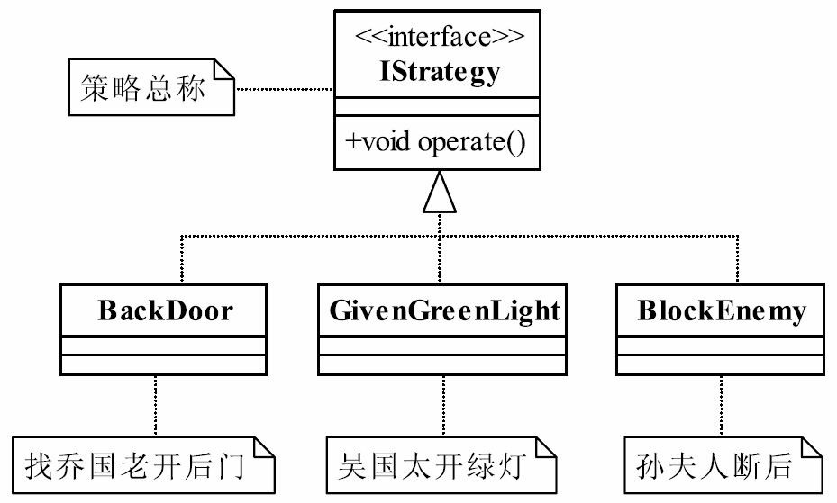

# 策略模式

继承的问题：对类的局部改动，超类的局部改动，会影响到所有子类，会有溢出效应。

略模式（Strategy Pattern）是一种比较简单的模式，也叫做政策模式（Policy Pattern）。其定义如下：Define a family of algorithms,encapsulate each one,and make them interchangeable.（定义一组算法，将每个算法都封装起来，并且使它们之间可以互换。）

分别封装行为的接口，实现算法族，超类里放行为接口对象，在子类里具体设定行为对象。原则：分离变化部分，封装接口，基于接口编程各中功能。此模式让行为算法的变化独立于算法的使用者。

策略模式使用的就是面向对象的继承和多态机制，非常容易理解和掌握，我们再来看看策略模式的三个角色：
● Context封装角色
它也叫做上下文角色，起承上启下封装作用，屏蔽高层模块对策略、算法的直接访问，封装可能存在的变化。
● Strategy抽象策略角色
策略、算法家族的抽象，通常为接口，定义每个策略或算法必须具有的方法和属性。各位看官可能要问了，类图中的AlgorithmInterface是什么意思，嘿嘿，algorithm是“运算法则”的意思，结合起来意思就明白了吧。
● ConcreteStrategy具体策略角色
实现抽象策略中的操作，该类含有具体的算法。



## `IStrategy.java`抽象策略角色

```java
/**
 * 锦囊妙计
 *
 * @author TomLuo
 * @date 2019/10/11
 */
public interface IStrategy {
    void operate();
}
```

##  具体策略角色

### `BackDoor.java`

```java
public class BackDoor implements IStrategy {
    @Override
    public void operate() {
        System.out.println("乔国老开后门");
    }
}
```

### `GivenGreenLight.java`

```java
public class GivenGreenLight implements IStrategy {
    @Override
    public void operate() {
        System.out.println("吴国太开绿灯");
    }
}
```

### `BlockEnemy.java`

```java
public class BlockEnemy implements IStrategy {
    @Override
    public void operate() {
        System.out.println("孙夫人断后");
    }
}
```

## `Context.java` Context封装角色

```java
public class Context {
    IStrategy iStrategy;

    // 构造函数，你要使用那个妙计
    public Context(IStrategy iStrategy) {
        this.iStrategy = iStrategy;
    }
    // 看赵云出招了
    public void operate() {
        this.iStrategy.operate();
    }
}
```

## `ContextTest.java`

```java
public class ContextTest {
    //赵云出场了，他根据诸葛亮给他的交代，依次拆开妙计
    public static void main(String[] args) {
        //刚刚到吴国的时候拆第一个
        System.out.println("---刚刚到吴国的时候拆第一个---");
        Context context=new Context(new BackDoor());
        context.operate();
        //刘备乐不思蜀了，拆第二个了
        System.out.println("---刘备乐不思蜀了，拆第二个了---");
        context=new Context(new GivenGreenLight());
        context.operate();
        //孙权的小兵追来了，咋办？拆第三个
        System.out.println("---孙权的小兵追来了，咋办？拆第三个---");
        context=new Context(new BlockEnemy());
        context.operate();
    }
}
```

## 策略模式的应用

### 策略模式的优点
● 算法可以自由切换
这是策略模式本身定义的，只要实现抽象策略，它就成为策略家族的一个成员，通过封装角色对其进行封装，保证对外提供“可自由切换”的策略。
● 避免使用多重条件判断
如果没有策略模式，我们想想看会是什么样子？一个策略家族有5个策略算法，一会要使用A策略，一会要使用B策略，怎么设计呢？使用多重的条件语句？多重条件语句不易维护，而且出错的概率大大增强。使用策略模式后，可以由其他模块决定采用何种策略，策略家族对外提供的访问接口就是封装类，简化了操作，同时避免了条件语句判断。
● 扩展性良好
这甚至都不用说是它的优点，因为它太明显了。在现有的系统中增加一个策略太容易了，只要实现接口就可以了，其他都不用修改，类似于一个可反复拆卸的插件，这大大地符合了OCP原则。

### 策略模式的缺点
● 策略类数量增多
每一个策略都是一个类，复用的可能性很小，类数量增多。
● 所有的策略类都需要对外暴露
上层模块必须知道有哪些策略，然后才能决定使用哪一个策略，这与迪米特法则是相违背的，我只是想使用了一个策略，我凭什么就要了解这个策略呢？那要你的封装类还有什么意义？这是原装策略模式的一个缺点，幸运的是，我们可以使用其他模式来修正这个缺陷，如工厂方法模式、代理模式或享元模式。

## 策略模式的使用场景

● 多个类只有在算法或行为上稍有不同的场景。
● 算法需要自由切换的场景。
例如，算法的选择是由使用者决定的，或者算法始终在进化，特别是一些站在技术前沿的行业，连业务专家都无法给你保证这样的系统规则能够存在多长时间，在这种情况下策略模式是你最好的助手。
● 需要屏蔽算法规则的场景。
现在的科技发展得很快，人脑的记忆是有限的（就目前来说是有限的），太多的算法你只要知道一个名字就可以了，传递相关的数字进来，反馈一个运算结果，万事大吉。

