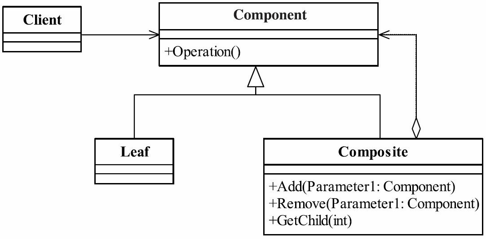

# 12.组合模式

## 组合模式的定义

组合模式(Composite Pattern)也叫合成模式，有时又叫做部分-整体模式（Part-Whole），主要是用来描述部分与整体的关系，其定义如下：
Compose objects into tree structures to represent part-whole hierarchies. Composite lets clients treat individual objects and compositions of objects uniformly.（将对象组合成树形结构以表示“部分-整体”的层次结构，使得用户对单个对象和组合对象的使用具有一致性。）



组合模式的几个角色。
● ● Composite树枝构件
树枝对象，它的作用是组合树枝节点和叶子节点形成一个树形结构。
定义参加组合对象的共有方法和属性，可以定义一些默认的行为或属性。

● Leaf叶子构件
叶子对象，其下再也没有其他的分支，也就是遍历的最小单位。

● Composite树枝构件
树枝对象，它的作用是组合树枝节点和叶子节点形成一个树形结构。

## Composite树枝构件

`MenuComponent.java`

```java
public abstract class MenuComponent {

    public String getName() {
        return "";
    }

    public String getDesc() {
        return "";
    }

    public float getPrice() {
        return 0f;
    }

    public boolean isVegetable() {
        return false;
    }

    public abstract void print() ;

    public Iterator<MenuComponent> getIterator(){
        return new NullIterator();
    }
}
```

`NullIterator.java`

```java
public class NullIterator implements Iterator<MenuComponent> {
    @Override
    public boolean hasNext() {
        return false;
    }

    @Override
    public MenuComponent next() {
        return null;
    }
}
```

## Leaf叶子构件`MenuItem.java`

```java
/**
 * 树叶节点是没有子下级对象的对象，定义参加组合的原始对象行为
 *
 * @author TomLuo
 * @date 2019/10/20
 */
@AllArgsConstructor
@Data
public class MenuItem extends MenuComponent {
    private String name, desc;
    private float price;
    private boolean vegetable;

    @Override
    public void print() {
        System.out.println("菜单：" + this.getName() + " 菜单描述：" + this.getDesc() +
                " 菜单价格：" + this.getPrice() + " 是否素食：" + this.isVegetable());
    }
}
```

## Composite树枝构件

`ComposeIterator.java`

```java
/**
 * 场景类负责树状结构的建立，并可以通过递归方式遍历整个树
 *
 * @author TomLuo
 * @date 2019/10/20
 */
public class ComposeIterator implements Iterator<MenuComponent> {
    private Stack<Iterator<MenuComponent>> stack = new Stack<>();

    public ComposeIterator(Iterator<MenuComponent> iterator) {
        stack.push(iterator);
    }

    @Override
    public boolean hasNext() {
        if (stack.empty()) {
            return false;
        }
        Iterator peek = stack.peek();
        if (!peek.hasNext()) {
            stack.pop();
            return hasNext();
        } else {
            return true;
        }
    }

    @Override
    public MenuComponent next() {
        if (hasNext()) {
            Iterator<MenuComponent> peek = stack.peek();
            MenuComponent next = peek.next();
            stack.push(next.getIterator());
            return next;
        }
        return null;
    }
}
```

`SubMenu.java`

```java
public class SubMenu extends MenuComponent {
    ArrayList<MenuComponent> menuItems;

    public SubMenu() {
        menuItems = new ArrayList<>();
        addItem("sandwich", "三明治", 4.5f);
        addItem("sausage", "热狗", 2.5f);
        addItem("cake", "蛋糕", 10f);
    }

    private void addItem(String name, String desc, float price) {
        menuItems.add(new MenuItem(name, desc, price, true));
    }

    @Override
    public void print() {
        System.out.println("这是子菜单");
    }

    @Override
    public Iterator<MenuComponent> getIterator() {
        return new ComposeIterator(menuItems.iterator());
    }
}
```

`CakeShopMenu.java`

```java
public class CakeShopMenu extends MenuComponent {
    ArrayList<MenuComponent> menuItems = new ArrayList<>();

    public CakeShopMenu() {
        addMenuItem("sandwich", "三明治", 4.5f, true);
        addMenuItem("sausage", "热狗", 2.5f, true);
        addMenuItem("cake", "蛋糕", 10f, true);
        addSubMenu(new SubMenu());
    }

    private void addSubMenu(MenuComponent subMenu) {
        menuItems.add(subMenu);
    }

    private void addMenuItem(String name, String desc, float price, boolean isVegetable) {
        menuItems.add(new MenuItem(name, desc, price, isVegetable));
    }

    public ArrayList<MenuComponent> getMenuItem() {
        return this.menuItems;
    }

    @Override
    public void print() {
        System.out.println("这是蛋糕店");
    }

    @Override
    public Iterator<MenuComponent> getIterator() {
        return new ComposeIterator(this.menuItems.iterator());
    }


}
```

`WestRestaurantMenu.java`

```java
public class WestRestaurantMenu extends MenuComponent {
    private static final int MAX_MENU_NUMBERS = 6;
    MenuComponent[] array = new MenuComponent[MAX_MENU_NUMBERS];
    int idx=0;
    public WestRestaurantMenu() {
        addMenuItem("pepper steak", "黑椒牛排", 70f,false);
        addMenuItem("filet steak", "腓力牛排", 120f,false);
        addMenuItem("sirloin steaks", "西冷牛排", 82f,false);
        addMenuItem("fried chicken wings", "炸鸡翅", 24f,false);
        addMenuItem("Big Mac", "巨无霸", 24f,false);
        addSubMenu(new SubMenu());
    }

    private void addSubMenu(MenuComponent menuComponent) {
        if(idx<MAX_MENU_NUMBERS) {
            array[idx++] = menuComponent;
        }
    }

    private void addMenuItem(String name, String desc, float price,boolean isVegetable) {
        if(idx<MAX_MENU_NUMBERS) {
            array[idx++] = new MenuItem(name, desc, price, isVegetable);
        }
    }

    public MenuComponent[] getMenuItem() {
        return this.array;
    }

    @Override
    public void print() {
        System.out.println("这是西餐厅");
    }

    @Override
    public Iterator<MenuComponent> getIterator() {
        return new ComposeIterator(new WestRestaurantMenuIterator());
    }

    private class WestRestaurantMenuIterator implements Iterator {
        int position;

        public WestRestaurantMenuIterator() {
            position = 0;
        }

        @Override
        public boolean hasNext() {
            if (position < MAX_MENU_NUMBERS) {
                return true;
            }
            return false;
        }

        @Override
        public MenuComponent next() {
            return array[position++];
        }
    }
}
```

## 测试类

`Waitress.java`

```java
public class Waitress {
    public ArrayList<MenuComponent> list=new ArrayList<>();
    public Waitress(){

    }
    public void addMenuComponent(MenuComponent menuComponent){
        list.add(menuComponent);
    }
    public void printMenu(){
        list.forEach( menu->{
            menu.print();
            Iterator<MenuComponent> iterator = menu.getIterator();
            while(iterator.hasNext()){
                MenuComponent next = iterator.next();
                next.print();
            }
        });
    }
}
```

`WaitressTest.java`

```java
public class WaitressTest {
    public static void main(String[] args) {
        Waitress waitress=new Waitress();
        CakeShopMenu cakeShopMenu = new CakeShopMenu();
        WestRestaurantMenu westRestaurantMenu = new WestRestaurantMenu();
        waitress.addMenuComponent(cakeShopMenu);
        waitress.addMenuComponent(westRestaurantMenu);
        waitress.printMenu();
    }
}
```

输出

```cmd
这是蛋糕店
菜单：sandwich 菜单描述：三明治 菜单价格：4.5 是否素食：true
菜单：sausage 菜单描述：热狗 菜单价格：2.5 是否素食：true
菜单：cake 菜单描述：蛋糕 菜单价格：10.0 是否素食：true
这是子菜单
菜单：sandwich 菜单描述：三明治 菜单价格：4.5 是否素食：true
菜单：sausage 菜单描述：热狗 菜单价格：2.5 是否素食：true
菜单：cake 菜单描述：蛋糕 菜单价格：10.0 是否素食：true
这是西餐厅
菜单：pepper steak 菜单描述：黑椒牛排 菜单价格：70.0 是否素食：false
菜单：filet steak 菜单描述：腓力牛排 菜单价格：120.0 是否素食：false
菜单：sirloin steaks 菜单描述：西冷牛排 菜单价格：82.0 是否素食：false
菜单：fried chicken wings 菜单描述：炸鸡翅 菜单价格：24.0 是否素食：false
菜单：Big Mac 菜单描述：巨无霸 菜单价格：24.0 是否素食：false
这是子菜单
菜单：sandwich 菜单描述：三明治 菜单价格：4.5 是否素食：true
菜单：sausage 菜单描述：热狗 菜单价格：2.5 是否素食：true
菜单：cake 菜单描述：蛋糕 菜单价格：10.0 是否素食：true
```

## 组合模式的应用
### 组合模式的优点
● 高层模块调用简单
一棵树形机构中的所有节点都是Component，局部和整体对调用者来说没有任何区别，也就是说，高层模块不必关心自己处理的是单个对象还是整个组合结构，简化了高层模块的代码。
● 节点自由增加
使用了组合模式后，我们可以看看，如果想增加一个树枝节点、树叶节点是不是都很容易，只要找到它的父节点就成，非常容易扩展，符合开闭原则，对以后的维护非常有利。

### 组合模式的缺点
组合模式有一个非常明显的缺点，看到我们在场景类中的定义，提到树叶和树枝使用时的定义了吗？直接使用了实现类！这在面向接口编程上是很不恰当的，与依赖倒置原则冲突，读者在使用的时候要考虑清楚，它限制了你接口的影响范围。

## 组合模式的使用场景
● 维护和展示部分-整体关系的场景，如树形菜单、文件和文件夹管理。
● 从一个整体中能够独立出部分模块或功能的场景。
## 组合模式的注意事项
只要是树形结构，就要考虑使用组合模式，这个一定要记住，只要是要体现局部和整体的关系的时候，而且这种关系还可能比较深，考虑一下组合模式吧。

