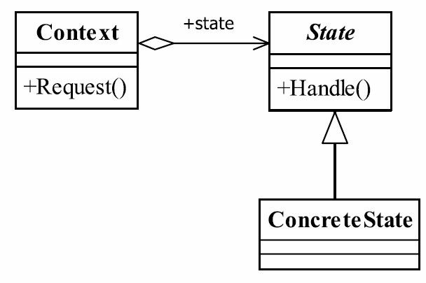

# 13.状态模式

## 状态模式的定义
Allow an object to alter its behavior when its internal state changes. The object will appear to
change its class.（当一个对象内在状态改变时允许其改变行为，这个对象看起来像改变了其类。）
状态模式的核心是封装，状态的变更引起了行为的变更，从外部看起来就好像这个对象对应的类发生了改变一样。



## 状态模式中的3个角色
● State——抽象状态角色
接口或抽象类，负责对象状态定义，并且封装环境角色以实现状态切换。

● ConcreteState——具体状态角色
每一个具体状态必须完成两个职责：本状态的行为管理以及趋向状态处理，通俗地说，就是本状态下要做的事情，以及本状态如何过渡到其他状态。

● Context——环境角色
定义客户端需要的接口，并且负责具体状态的切换。
状态模式相对来说比较复杂，它提供了一种对物质运动的另一个观察视角，通过状态变更促使行为的变化，就类似水的状态变更一样，一碗水的初始状态是液态，通过加热转变为气态，状态的改变同时也引起体积的扩大，然后就产生了一个新的行为：鸣笛或顶起壶盖，瓦特就是这么发明蒸汽机的。

## 抽象状态角色`LiftState.java`

```java
@Setter
public abstract class LiftState {
    /**
     * 定义一个环境角色，也就是封装状态的变化引起的功能变化
     */
    protected Context context;

    abstract void stop();

    abstract void run();

    abstract void open();

    abstract void close();
}
```

## 具体状态角色

`LiftCloseState.java`

```java
public class LiftCloseState extends LiftState {
    @Override
    public void stop() {
        super.context.setState(Context.stopState);
        super.context.getState().stop();
    }

    @Override
    public void run() {
        super.context.setState(Context.runState);
        super.context.getState().run();
    }

    @Override
    public void open() {
        super.context.setState(Context.openState);
        super.context.getState().open();
    }

    @Override
    public void close() {
        System.out.println("电梯关门了");
    }
}
```

`LiftOpenState.java`

```java
public class LiftOpenState extends LiftState {
    @Override
    public void stop() {
    }

    @Override
    public void run() {

    }

    @Override
    public void open() {
        System.out.println("电梯打开了");
    }

    @Override
    public void close() {
        super.context.setState(Context.closeState);
        super.context.getState().close();
    }
}
```

`LiftRunState.java`

```java
public class LiftRunState extends LiftState {
    @Override
    public void stop() {
        super.context.setState(Context.stopState);
        super.context.getState().stop();
    }

    @Override
    public void run() {
        System.out.println("电梯在运行");
    }

    @Override
    public void open() {

    }

    @Override
    public void close() {
    }
}
```

`LiftStopState.java`

```java
public class LiftStopState extends LiftState {
    @Override
    public void stop() {
        System.out.println("电梯停止了");
    }

    @Override
    public void run() {
        super.context.setState(Context.runState);
        super.context.getState().run();
    }

    @Override
    public void open() {
        super.context.setState(Context.openState);
        super.context.getState().open();
    }

    @Override
    public void close() {
    }
}
```

## 环境角色`Context.java`

```java
public class Context {
    private LiftState state;
    public static final LiftState CLOSE_STATE = new LiftCloseState();
    public static final LiftState OPEN_STATE = new LiftOpenState();
    public static final LiftState RUN_STATE = new LiftRunState();
    public static final LiftState STOP_STATE = new LiftStopState();

    public LiftState getState() {
        return this.state;
    }

    public void setState(LiftState state) {
        this.state = state;
        this.state.setContext(this);
    }

    public void close() {
        this.state.close();
    }

    public void open() {
        this.state.open();
    }

    public void run() {
        this.state.run();
    }

    public void stop() {
        this.state.stop();
    }
}
```

## 测试类`ContextTest.java`

```java
public class ContextTest {
    public static void main(String[] args) {
        Context context = new Context();
        context.setState(Context.CLOSE_STATE);
        context.open();
        context.close();
        context.run();
        context.stop();
    }
}
```

输出

```cmd
电梯打开了
电梯关门了
电梯在运行
电梯停止了
```

## 状态模式的应用
### 状态模式的优点
● 结构清晰
避免了过多的switch...case或者if...else语句的使用，避免了程序的复杂性,提高系统的可维护性。
● 遵循设计原则
很好地体现了开闭原则和单一职责原则，每个状态都是一个子类，你要增加状态就要增加子类，你要修改状态，你只修改一个子类就可以了。
● 封装性非常好
这也是状态模式的基本要求，状态变换放置到类的内部来实现，外部的调用不用知道类内部如何实现状态和行为的变换。

### 状态模式的缺点
状态模式既然有优点，那当然有缺点了。但只有一个缺点，子类会太多，也就是类膨胀。如果一个事物有很多个状态也不稀奇，如果完全使用状态模式就会有太多的子类，不好管理，这个需要大家在项目中自己衡量。其实有很多方式可以解决这个状态问题，如在数据库中建立一个状态表，然后根据状态执行相应的操作，这个也不复杂，看大家的习惯和嗜好了。

## 状态模式的使用场景
● 行为随状态改变而改变的场景
这也是状态模式的根本出发点，例如权限设计，人员的状态不同即使执行相同的行为结果也会不同，在这种情况下需要考虑使用状态模式。
● 条件、分支判断语句的替代者
在程序中大量使用switch语句或者if判断语句会导致程序结构不清晰，逻辑混乱，使用状态模式可以很好地避免这一问题，它通过扩展子类实现了条件的判断处理。

## 状态模式的注意事项
状态模式适用于当某个对象在它的状态发生改变时，它的行为也随着发生比较大的变化，也就是说在行为受状态约束的情况下可以使用状态模式，而且使用时对象的状态最好不要超过5个。

