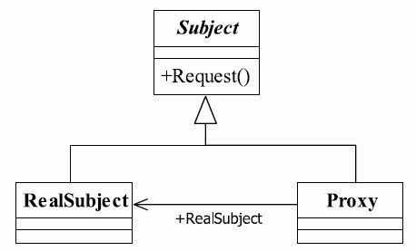

# 14.代理模式

## 代理模式的定义

代理模式（Proxy Pattern）是一个使用率非常高的模式，其定义如下：
Provide a surrogate or placeholder for another object to control access to it.（为其他对象提供一种代理以控制对这个对象的访问。）



## 三个角色的定义
● Subject抽象主题角色
抽象主题类可以是抽象类也可以是接口，是一个最普通的业务类型定义，无特殊要求。
● RealSubject具体主题角色
也叫做被委托角色、被代理角色。它才是冤大头，是业务逻辑的具体执行者。
● Proxy代理主题角色
也叫做委托类、代理类。它负责对真实角色的应用，把所有抽象主题类定义的方法限制委托给真实主题角色实现，并且在真实主题角色处理完毕前后做预处理和善后处理工作。

## Subject抽象主题角色`IGamePlayer.java`

```java
public interface IGamePlayer {
    void login(String name,String password);
    void killBoss();
    void upgrade();
}
```

## RealSubject具体主题角色`GamePlayer.java`

```java
public class GamePlayer implements IGamePlayer {
    private String name;

    @Override
    public void login(String name,String password) {
        this.name = name;
        System.out.println(this.name+" 登陆游戏系统成功！");
    }

    @Override
    public void killBoss() {
        System.out.println(this.name+" 打怪！");
    }

    @Override
    public void upgrade() {
        System.out.println(this.name+" 又升了一级！");
    }
}
```

## Proxy代理主题角色

### 普通实现`ProxyGamePlayer.java`

```java
public class ProxyGamePlayer implements IGamePlayer {
    IGamePlayer gamePlayer;

    public ProxyGamePlayer(IGamePlayer gamePlayer) {
        this.gamePlayer = gamePlayer;
    }

    @Override
    public void login(String name, String password) {
        this.gamePlayer.login(name,password);
    }

    @Override
    public void killBoss() {
        this.gamePlayer.killBoss();
    }

    @Override
    public void upgrade() {
        this.gamePlayer.upgrade();
    }
}
```

`GamePlayerTest.java`

```java
public class GamePlayerTest {
    public static void main(String[] args) {
        IGamePlayer gamePlayer=new GamePlayer();
        gamePlayer.login("Tom","123");
        gamePlayer.killBoss();
        gamePlayer.upgrade();
        System.out.println("找个代理公司帮我玩游戏。。。");
        IGamePlayer proxyGamePlayer = new ProxyGamePlayer(gamePlayer);
        proxyGamePlayer.login("Tom","123");
        proxyGamePlayer.killBoss();
        proxyGamePlayer.upgrade();
    }
}
```

输出

```cmd
Tom 登陆游戏系统成功！
Tom 打怪！
Tom 又升了一级！
找个代理公司帮我玩游戏。。。
Tom 登陆游戏系统成功！
Tom 打怪！
Tom 又升了一级！

```

### JDK动态代理

#### 定义一个前置通知

`Advice.java`

```java
public interface Advice {
    void exe();
}
```

`BeforeAdvice.java`

```java
public class BeforeAdvice implements Advice {
    @Override
    public void exe() {
        System.out.println("前置通知！");
    }
}
```

#### 代理接管调用方法类`MyInvocationHandler.java`

```java
public class MyInvocationHandler implements InvocationHandler {
    private Object target;

    public MyInvocationHandler(Object target) {
        this.target = target;
    }

    @Override
    public Object invoke(Object proxy, Method method, Object[] args) throws Throwable {
        Advice beforeAdvice = new BeforeAdvice();
        beforeAdvice.exe();
        return method.invoke(this.target, args);
    }
}
```

#### 动态代理生成类`DynamicProxy.java`

```java
public class DynamicProxy{
    public static <T> T newProxyInstance(T target) {
        ClassLoader classLoader = target.getClass().getClassLoader();
        Class<?>[] classes = target.getClass().getInterfaces();
        MyInvocationHandler handler = new MyInvocationHandler(target);
        return (T) Proxy.newProxyInstance(classLoader, classes, handler);
    }
}
```

`DynamicProxyTest.java`

```java
public class DynamicProxyTest {
    public static void main(String[] args) {
        IGamePlayer gamePlayer=new GamePlayer();

        IGamePlayer proxyGamePlayer = DynamicProxy.newProxyInstance(gamePlayer);
        proxyGamePlayer.login("Tom","123");
        proxyGamePlayer.killBoss();
        proxyGamePlayer.upgrade();
    }
}
```

输出

```cmd
前置通知！
Tom 登陆游戏系统成功！
前置通知！
Tom 打怪！
前置通知！
Tom 又升了一级！
```

## 代理模式的优点
● 职责清晰
真实的角色就是实现实际的业务逻辑，不用关心其他非本职责的事务，通过后期的代理完成一件事务，附带的结果就是编程简洁清晰。
● 高扩展性
具体主题角色是随时都会发生变化的，只要它实现了接口，甭管它如何变化，都逃不脱如来佛的手掌（接口），那我们的代理类完全就可以在不做任何修改的情况下使用。
● 智能化

