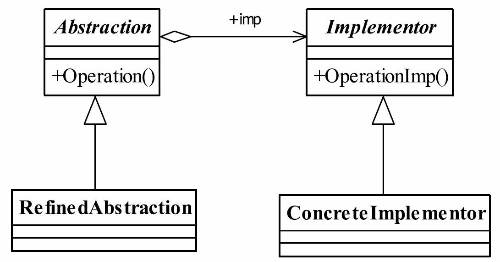

# 15.桥梁模式

## 桥梁模式的定义
桥梁模式（Bridge Pattern）也叫做桥接模式，是一个比较简单的模式，其定义如下：
Decouple an abstraction from its implementation so that the two can vary independently.（将抽象和实现解耦，使得两者可以独立地变化。）



## 桥梁模式中的4个角色。
● Abstraction——抽象化角色
它的主要职责是定义出该角色的行为，同时保存一个对实现化角色的引用，该角色一般是抽象类。
● Implementor——实现化角色
它是接口或者抽象类，定义角色必需的行为和属性。
● RefinedAbstraction——修正抽象化角色
它引用实现化角色对抽象化角色进行修正。
● ConcreteImplementor——具体实现化角色
它实现接口或抽象类定义的方法和属性。

## 实现化角色`Product.java`

```java
public interface Product {
    void produce();
    void sell();
}
```

## 具体实现化角色

### `Mobile.java`

```java
public class Mobile implements Product {
    @Override
    public void produce() {
        System.out.println("开始生产手机");
    }

    @Override
    public void sell() {
        System.out.println("手机卖钱了");
    }
}
```

### `Tour.java`

```java
public class Tour implements Product {
    @Override
    public void produce() {
        System.out.println("开始建旅游项目");
    }

    @Override
    public void sell() {
        System.out.println("旅游项目赚钱了");
    }
}
```

### `House.java`

```java
public class House implements Product {
    @Override
    public void produce() {
        System.out.println("开始盖公寓");
    }

    @Override
    public void sell() {
        System.out.println("公寓卖钱了");
    }
}
```

## 抽象化角色`Corp.java`

```java
public abstract class Corp {
    Product product;

    public Corp(Product product) {
        this.product = product;
    }

    protected void makeMoney() {
        this.product.produce();
        this.product.sell();
    }
}
```

## 具体抽象化角色

### `HouseCorp.java`

```java
public class HouseCorp extends Corp {
    public HouseCorp(Product product) {
        super(product);
    }

    @Override
    protected void makeMoney() {
        super.makeMoney();
        System.out.println("房地产公司赚钱了");
    }
}
```

### `FakeCorp.java`

```java
public class FakeCorp extends Corp {
    public FakeCorp(Product product) {
        super(product);
    }

    @Override
    protected void makeMoney() {
        super.makeMoney();
        System.out.println("山寨公司赚钱了");
    }
}
```

## 场景类`CorpTest.java`

```java
public class CorpTest {
    public static void main(String[] args) {
        System.out.println("~~~~~~山寨公司是这样运作的~~~~~~");
        Corp fakeCorp = new FakeCorp(new Mobile());
        fakeCorp.makeMoney();
        System.out.println("~~~~~~房产公司是这样运作的~~~~~~");
        Corp houseCorp = new HouseCorp(new House());
        houseCorp.makeMoney();
        System.out.println("~~~~~~员工养不活，干点副业，房产公司是这样运作的~~~~~~");
        houseCorp = new HouseCorp(new Mobile());
        houseCorp.makeMoney();
        System.out.println("~~~~~~旅游赚钱，房产公司是这样运作的~~~~~~");
        houseCorp = new HouseCorp(new Tour());
        houseCorp.makeMoney();
    }
}
```

输出

```cmd
~~~~~~山寨公司是这样运作的~~~~~~
开始生产手机
手机卖钱了
山寨公司赚钱了
~~~~~~房产公司是这样运作的~~~~~~
开始盖公寓
公寓卖钱了
房地产公司赚钱了
~~~~~~员工养不活，干点副业，房产公司是这样运作的~~~~~~
开始生产手机
手机卖钱了
房地产公司赚钱了
~~~~~~旅游赚钱，房产公司是这样运作的~~~~~~
开始建旅游项目
旅游项目赚钱了
房地产公司赚钱了
```

## 桥梁模式的应用
### 桥梁模式的优点
● 抽象和实现分离
这也是桥梁模式的主要特点，它完全是为了解决继承的缺点而提出的设计模式。在该模式下，实现可以不受抽象的约束，不用再绑定在一个固定的抽象层次上。
● 优秀的扩充能力
看看我们的例子，想增加实现？没问题！想增加抽象，也没有问题！只要对外暴露的接口层允许这样的变化，我们已经把变化的可能性减到最小。
● 实现细节对客户透明
客户不用关心细节的实现，它已经由抽象层通过聚合关系完成了封装。

### 桥梁模式的使用场景
● 不希望或不适用使用继承的场景
例如继承层次过渡、无法更细化设计颗粒等场景，需要考虑使用桥梁模式。
● 接口或抽象类不稳定的场景
明知道接口不稳定还想通过实现或继承来实现业务需求，那是得不偿失的，也是比较失败的做法。
● 重用性要求较高的场景
设计的颗粒度越细，则被重用的可能性就越大，而采用继承则受父类的限制，不可能出现太细的颗粒度。

## 桥梁模式的注意事项
桥梁模式是非常简单的，使用该模式时主要考虑如何拆分抽象和实现，并不是一涉及继承就要考虑使用该模式，那还要继承干什么呢？桥梁模式的意图还是对变化的封装，尽量把可能变化的因素封装到最细、最小的逻辑单元中，避免风险扩散。因此读者在进行系统设计时，发现类的继承有N层时，可以考虑使用桥梁模式。

> 桥接的目的就是分离抽象与实现，使抽象与实现可以独立变化。
>
> 系统有多维度分类，而每一种分类又有可能变化，考虑使用桥接模式。

