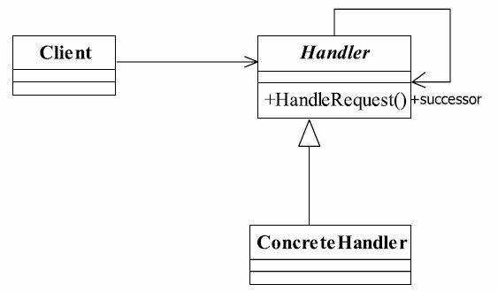

# 17.责任链模式

## 责任链模式的定义
责任链模式定义如下：
Avoid coupling the sender of a request to its receiver by giving more than one object a chance to handle the request. Chain the receiving objects and pass the request along the chain until an object handles it.（使多个对象都有机会处理请求，从而避免了请求的发送者和接受者之间的耦合关系。将这些对象连成一条链，并沿着这条链传递该请求，直到有对象处理它为止。）
责任链模式的重点是在“链”上，由一条链去处理相似的请求在链中决定谁来处理这个请求，并返回相应的结果



## 抽象处理者`Approver.java`

```java
public abstract class Approver {
    protected String name;

    public Approver(String name) {
        this.name = name;
    }

    protected Approver successor;

    protected void setApprover(Approver successor) {
        this.successor = successor;
    }

    protected abstract void processRequest(PurchaseRequest purchaseRequest);
}
```

## 具体处理者

### `GroupApprover.java`

```java
public class GroupApprover extends Approver {


    public GroupApprover(String name) {
        super(name+"组长");
    }

    @Override
    protected void processRequest(PurchaseRequest purchaseRequest) {
        if (purchaseRequest.getTotal() < 5000f) {
            System.out.println(this.name + "批准" + purchaseRequest.getName() + "的价格为：" + purchaseRequest.getPrice() + " 采购数量为：" + purchaseRequest.getNum() + " 总计：" + purchaseRequest.getTotal());
        } else {
            successor.processRequest(purchaseRequest);
        }
    }
}
```

### `DepartmentApprover.java`

```java
public class DepartmentApprover extends Approver {


    public DepartmentApprover(String name) {
        super(name+"部长");
    }

    @Override
    protected void processRequest(PurchaseRequest purchaseRequest) {
        if (purchaseRequest.getTotal() >= 5000f && purchaseRequest.getTotal() < 10000f) {
            System.out.println(this.name + "批准" + purchaseRequest.getName() + "的价格为：" + purchaseRequest.getPrice() + " 采购数量为：" + purchaseRequest.getNum() + " 总计：" + purchaseRequest.getTotal());
        } else {
            successor.processRequest(purchaseRequest);
        }
    }
}
```

### `VicePresentApprover.java`

```java
public class VicePresentApprover extends Approver {


    public VicePresentApprover(String name) {
        super(name+"副总裁");
    }

    @Override
    protected void processRequest(PurchaseRequest purchaseRequest) {
        if (purchaseRequest.getTotal() >= 10000f && purchaseRequest.getTotal() < 20000f) {
            System.out.println(this.name + "批准" + purchaseRequest.getName() + "的价格为：" + purchaseRequest.getPrice() + " 采购数量为：" + purchaseRequest.getNum() + " 总计：" + purchaseRequest.getTotal());
        } else {
            successor.processRequest(purchaseRequest);
        }
    }
}

```

### `PresentApprover.java`

```java
public class PresentApprover extends Approver {

    public PresentApprover(String name) {
        super(name+"总裁");
    }

    @Override
    protected void processRequest(PurchaseRequest purchaseRequest) {
        if (purchaseRequest.getTotal() >= 20000f) {
            System.out.println(this.name + "批准" + purchaseRequest.getName() + "的价格为：" + purchaseRequest.getPrice() + " 采购数量为：" + purchaseRequest.getNum() + " 总计：" + purchaseRequest.getTotal());
        } else {
            successor.processRequest(purchaseRequest);
        }
    }
}
```

## 封装请求`Client.java`

```java
@NoArgsConstructor
public class Client {
    public  PurchaseRequest sendRequest(String name, int price, int num) {
        return new PurchaseRequest(name, price, num);
    }
}
```

## 场景类`ApproverTest.java`

```java
public class ApproverTest {
    public static void main(String[] args) {
        Client client=new Client();
        GroupApprover tom = new GroupApprover("tom");
        DepartmentApprover jack = new DepartmentApprover("Jack");
        VicePresentApprover rose = new VicePresentApprover("rose");
        PresentApprover green = new PresentApprover("Green");
        tom.setApprover(jack);
        jack.setApprover(rose);
        rose.setApprover(green);
        green.setApprover(tom);
        tom.processRequest(client.sendRequest("花生", 8, 400));
        tom.processRequest(client.sendRequest("苹果", 10, 800));
        tom.processRequest(client.sendRequest("笔记本电脑", 12000, 1));
        tom.processRequest(client.sendRequest("办公桌", 2000, 12));
    }
}
```

输出

```cmd
tom组长批准花生的价格为：8.0 采购数量为：400.0 总计：3200.0
Jack部长批准苹果的价格为：10.0 采购数量为：800.0 总计：8000.0
rose副总裁批准笔记本电脑的价格为：12000.0 采购数量为：1.0 总计：12000.0
Green总裁批准办公桌的价格为：2000.0 采购数量为：12.0 总计：24000.0
```

 ## 责任链模式的应用
### 责任链模式的优点
责任链模式非常显著的优点是将请求和处理分开。请求者可以不用知道是谁处理的，处理者可以不用知道请求的全貌，两者解耦，提高系统的灵活性。
### 责任链模式的缺点
责任链有两个非常显著的缺点：一是性能问题，每个请求都是从链头遍历到链尾，特别是在链比较长的时候，性能是一个非常大的问题。二是调试不很方便，特别是链条比较长，环节比较多的时候，由于采用了类似递归的方式，调试的时候逻辑可能比较复杂。
## 责任链模式的注意事项
链中节点数量需要控制，避免出现超长链的情况，一般的做法是在Handler中设置一个最大节点数量，在setNext方法中判断是否已经是超过其阈值，超过则不允许该链建立，避免无意识地破坏系统性能。

