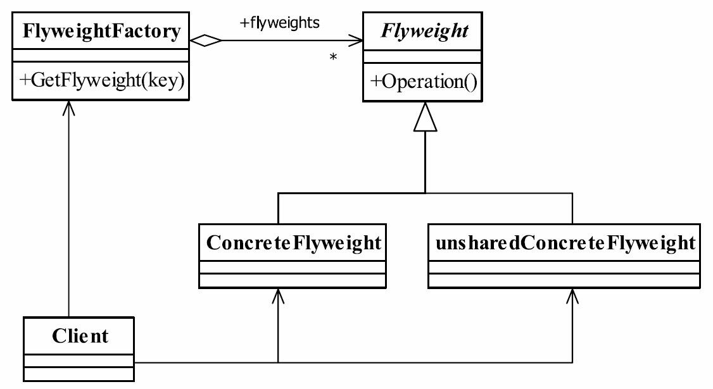

# 18.享元模式

## 享元模式的定义
享元模式（Flyweight Pattern）是池技术的重要实现方式，其定义如下：Use sharing to support large numbers of fine-grained objects efficiently.（使用共享对象可有效地支持大量的细粒度的对象。）

要求细粒度对象，那么不可避免地使得对象数量多且性质相近，那我们就将这些对象的信息分为两个部分：内部状态（intrinsic）与外部状态（extrinsic）。
● 内部状态
内部状态是对象可共享出来的信息，存储在享元对象内部并且不会随环境改变而改变，如我们例子中的id、postAddress等，它们可以作为一个对象的动态附加信息，不必直接储存在具体某个对象中，属于可以共享的部分。
● 外部状态
外部状态是对象得以依赖的一个标记，是随环境改变而改变的、不可以共享的状态，如我们例子中的考试科目+考试地点复合字符串，它是一批对象的统一标识，是唯一的一个索引值。



## 享元模式角色
● Flyweight——抽象享元角色
它简单地说就是一个产品的抽象类，同时定义出对象的外部状态和内部状态的接口或实现。
● ConcreteFlyweight——具体享元角色
具体的一个产品类，实现抽象角色定义的业务。该角色中需要注意的是内部状态处理应该与环境无关，不应该出现一个操作改变了内部状态，同时修改了外部状态，这是绝对不允许的。
● unsharedConcreteFlyweight——不可共享的享元角色
不存在外部状态或者安全要求（如线程安全）不能够使用共享技术的对象，该对象一般不会出现在享元工厂中。
● FlyweightFactory——享元工厂
职责非常简单，就是构造一个池容器，同时提供从池中获得对象的方法。

## 抽象享元角色`Plant.java`

```java
public abstract class Plant {
    protected abstract void display(int xCoord, int yCoord, int age);
}
```

## 不可共享的享元角色

`Grass.java`

```java
public class Grass extends Plant {
@Override
    public void display(int xCoord, int yCoord, int age) {
        // System.out.println("树的横坐标为：" + this.xCoord + " 纵坐标为：" + this.yCoord + " 树龄为：" + this.age);
    }
}
```

`Tree.java`

```java
public class Tree extends Plant {
    @Override
    public void display(int xCoord, int yCoord, int age) {
        // System.out.println("树的横坐标为：" + this.xCoord + " 纵坐标为：" + this.yCoord + " 树龄为：" + this.age);
    }
}
```

## 具体享元角色`PlantManager.java`

```java
public class PlantManager {
    int count = 10000000;
    int[] aryXcoords = new int[count];
    int[] aryYcoords = new int[count];
    int[] aryAges = new int[count];
    int[] aryTypes = new int[count];
    PlantFactory plantFactory;

    public PlantManager() {
        plantFactory = new PlantFactory();
        for (int idx = 0; idx < count; idx++) {
            aryXcoords[idx] = (int) (Math.random() * count);
            aryYcoords[idx] = (int) (Math.random() * count);
            aryAges[idx] = (int) (Math.random() * count) % 5;
            aryTypes[idx] = (int) (Math.random() * count) % 2;
        }
    }

    public void displayPlants() {
        for (int idx = 0; idx < count; idx++) {
            plantFactory.getPlant(aryTypes[idx]).display(aryXcoords[idx], aryYcoords[idx], aryAges[idx]);
        }
    }
}
```

## 享元工厂`PlantFactory.java`

```java
@Slf4j
public class PlantFactory {
    HashMap<Integer, Plant> map = new HashMap<>();

    public Plant getPlant(int type) {
        if (!map.containsKey(type)) {
            switch (type) {
                case 0:
                    map.put(type, new Tree());
                    break;
                case  1:
                    map.put(type, new Grass());
                    break;
                default:
                    log.info("not support type");
                    break;
            }
        }
        return map.get(type);
    }
}
```

## 测试场景类`MainTest.java`

```java
public class MainTest {
    private static void showMemory(long begin) {
        //最大内存
        long maxMemory = Runtime.getRuntime().maxMemory();
        //分配内存
        long totalMemory = Runtime.getRuntime().totalMemory();
        //已分配内存的剩余内存
        long freeMemory = Runtime.getRuntime().freeMemory();
        //已用内存
        long usedMemory = totalMemory - freeMemory;
        System.out.println("最大内存：" + maxMemory / 1024 / 1024 + "兆");
        System.out.println("分配内存：" + totalMemory / 1024 / 1024 + "兆");
        System.out.println("已分配内存的剩余内存：" + freeMemory / 1024 / 1024 + "兆");
        System.out.println("已用内存：" + usedMemory / 1024 / 1024 + "兆");
        System.out.println("时间：" + (System.currentTimeMillis() - begin) / 1000 + " 秒");
        System.out.println();
    }

    public static void main(String[] args) {
        System.out.println("~~~~~~~~~~~~~~~~~~使用绳量模式~~~~~~~~~~~~~~~~~~");
        long begin = System.currentTimeMillis();
        showMemory(begin);
        begin = System.currentTimeMillis();
        PlantManager treeTest = new PlantManager();
        showMemory(begin);
        begin = System.currentTimeMillis();
        treeTest.displayPlants();
        showMemory(begin);
    }
}
```


输出：

```cmd
~~~~~~~~~~~~~~~~~~使用绳量模式~~~~~~~~~~~~~~~~~~
最大内存：7252兆
分配内存：489兆
已分配内存的剩余内存：481兆
已用内存：7兆
时间：0 秒

最大内存：7252兆
分配内存：489兆
已分配内存的剩余内存：329兆
已用内存：159兆
时间：0 秒

最大内存：7252兆
分配内存：489兆
已分配内存的剩余内存：326兆
已用内存：162兆
时间：0 秒
```

## 享元模式的应用
### 享元模式的优点和缺点
享元模式是一个非常简单的模式，它可以大大减少应用程序创建的对象，降低程序内存的占用，增强程序的性能，但它同时也提高了系统复杂性，需要分离出外部状态和内部状态，而且外部状态具有固化特性，不应该随内部状态改变而改变，否则导致系统的逻辑混乱。

## 享元模式的使用场景
在如下场景中则可以选择使用享元模式。
● 系统中存在大量的相似对象。
● 细粒度的对象都具备较接近的外部状态，而且内部状态与环境无关，也就是说对象没有特定身份。
● 需要缓冲池的场景。