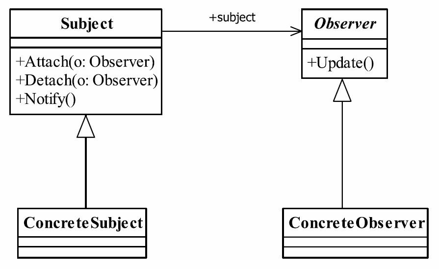

# 2.观察者模式

观察者模式（Observer Pattern）也叫做发布订阅模式（Publish/subscribe）,它是一个在项目中经常使用的模式，其定义如下：
Define a one-to-many dependency between objects so that when one object changes state,all its dependents are notified and updated automatically.（定义对象间一种一对多的依赖关系，使得每当一个对象改变状态，则所有依赖于它的对象都会得到通知并被自动更新。）



## 观察者模式的几个角色名称

* Subject被观察者
  定义被观察者必须实现的职责，它必须能够动态地增加、取消观察者。它一般是抽象类或者是实现类，仅仅完成作为被观察者必须实现的职责：管理观察者并通知观察者。
* Observer观察者
  观察者接收到消息后，即进行update（更新方法）操作，对接收到的信息进行处理。
* ConcreteSubject具体的被观察者
  定义被观察者自己的业务逻辑，同时定义对哪些事件进行通知。
* ConcreteObserver具体的观察者
  每个观察在接收到消息后的处理反应是不同，各个观察者有自己的处理逻辑。

## 定义奶站为被观察者`MilkSite.java`

```java
public abstract class MilkSite {
    Vector<Customer> vectors = new Vector<>();

    void addCustomer(Customer o) {
        vectors.add(o);
    }

    void removeCustomer(Customer o) {
        if (vectors.contains(o)) {
            vectors.remove(o);
        }
    }

    void notifyCustomers() {
        vectors.forEach(c -> {
            c.haveMilk();
        });
    }

    /**
     * 实现自己的业务逻辑-提供牛奶并通知客户
     */
    public abstract void providerMilk();
}
```

## 具体的奶站业务`ConcreteMilkSite.java`

```java
public class ConcreteMilkSite extends MilkSite {
    @Override
    public void providerMilk() {
        System.out.println("奶站有牛奶提供了，通知外送给用户");
        notifyCustomers();
    }
}
```

## 定义用户`Customer.java`

有牛奶时通知用户

```java
public interface Customer {
    void haveMilk();
}
```

## 定义具体的用户

`CustomerJack.java`

```java
public class CustomerJack implements Customer {
    @Override
    public void haveMilk() {
        System.out.println("牛奶送到，Jack 可以喝牛奶了");
    }
}
```

`CustomerTom.java`

```java
public class CustomerTom implements Customer {
    @Override
    public void haveMilk() {
        System.out.println("牛奶送到，Tom 可以喝牛奶了");
    }
}
```

## 测试`MilkSiteTest.java`

```java
public class MilkSiteTest {
    public static void main(String[] args) {
        MilkSite milkSite=new ConcreteMilkSite();
        Customer tom=new CustomerTom();
        Customer jack=new CustomerJack();
        milkSite.addCustomer(jack);
        milkSite.addCustomer(tom);
        milkSite.providerMilk();
        System.out.println("tom不想订牛奶了");
        milkSite.removeCustomer(tom);
        milkSite.providerMilk();
    }
}
```

输出

```cmd
奶站有牛奶提供了，通知外送给用户
牛奶送到，Jack 可以喝牛奶了
牛奶送到，Tom 可以喝牛奶了
tom不想订牛奶了
奶站有牛奶提供了，通知外送给用户
牛奶送到，Jack 可以喝牛奶了
```

## 观察者模式的应用
### 观察者模式的优点
● 观察者和被观察者之间是抽象耦合
如此设计，则不管是增加观察者还是被观察者都非常容易扩展，而且在Java中都已经实现的抽象层级的定义，在系统扩展方面更是得心应手。
● 建立一套触发机制
根据单一职责原则，每个类的职责是单一的，那么怎么把各个单一的职责串联成真实世界的复杂的逻辑关系呢？比如，我们去打猎，打死了一只母鹿，母鹿有三个幼崽，因失去了母鹿而饿死，尸体又被两只秃鹰争抢，因分配不均，秃鹰开始斗殴，然后羸弱的秃鹰死掉，生存下来的秃鹰，则因此扩大了地盘……这就是一个触发机制，形成了一个触发链。观察者模式可以完美地实现这里的链条形式。

### 观察者模式的缺点
观察者模式需要考虑一下开发效率和运行效率问题，一个被观察者，多个观察者，开发和调试就会比较复杂，而且在Java中消息的通知默认是顺序执行，一个观察者卡壳，会影响整体的执行效率。在这种情况下，一般考虑采用异步的方式。
多级触发时的效率更是让人担忧，大家在设计时注意考虑。

## 观察者模式的使用场景
● 关联行为场景。需要注意的是，关联行为是可拆分的，而不是“组合”关系。
● 事件多级触发场景。
● 跨系统的消息交换场景，如消息队列的处理机制。