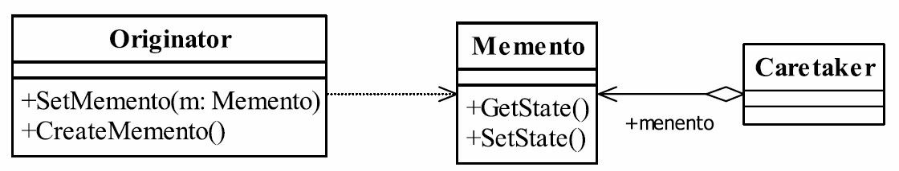

# 21.备忘录模式

## 备忘录模式的定义
备忘录模式（Memento Pattern）提供了一种弥补真实世界缺陷的方法，让“后悔药”在程序的世界中真实可行，其定义如下：
Without violating encapsulation,capture and externalize an object's internal state so that the object can be restored to this state later.（在不破坏封装性的前提下，捕获一个对象的内部状态，并在该对象之外保存这个状态。这样以后就可将该对象恢复到原先保存的状态。）



## 备忘录模式的角色
● Originator发起人角色
记录当前时刻的内部状态，负责定义哪些属于备份范围的状态，负责创建和恢复备忘录数据。
● Memento备忘录角色
负责存储Originator发起人对象的内部状态，在需要的时候提供发起人需要的内部状态。
● Caretaker备忘录管理员角色
对备忘录进行管理、保存和提供备忘录。

## 实例

### 发起人角色 

#### `Originator.java`

```java
public class Originator {
    private HashMap<String,String> state;

    public Originator() {
        this.state = new HashMap<>();
    }
    public MementoIF createMemento(){
        return new Memento(state);
    }
    public void restoreMemento(MementoIF mementoIF){
         this.state = ((Memento)mementoIF).getState();
    }
    public void showState(){
        System.out.println(JSON.toJSONString(this.state,true));
    }
    public void testState1(){
        state.put("blood","500");
        state.put("process","gate1");
        state.put("enemy","50");
    }
    public void testState2(){
        state.put("blood","200");
        state.put("process","gate3");
        state.put("enemy","510");
    }
    @Setter
    @Getter
    private class Memento implements MementoIF {
        private HashMap<String,String> state;
        public Memento(HashMap<String, String> state) {
            this.state =new HashMap<>(state) ;
        }
    }
}
```

#### `Originator2.java`

```java
public class Originator2 {
    private ArrayList<String> state;

    public Originator2() {
        this.state = new ArrayList<>();
    }

    public MementoIF createMemento() {
        return new Memento(state);
    }

    public void restoreMemento(MementoIF mementoIF) {
        this.state = ((Memento) mementoIF).getState();
    }

    public void showState() {
        System.out.println(JSON.toJSONString(this.state, true));
    }

    public void testState1() {
        this.state = new ArrayList<>();
        state.add("blood:500");
        state.add("process:gate1");
        state.add("enemy:50");
    }

    public void testState2() {
        this.state = new ArrayList<>();
        state.add("blood:200");
        state.add("process:gate3");
        state.add("enemy:510");
    }

    @Setter
    @Getter
    private class Memento implements MementoIF {
        private ArrayList<String> state;
        public Memento(ArrayList<String> state) {
            this.state = state;
        }
    }
}
```

### 备忘录角色

```java
Originator.Memento
Originator2.Memento    
```

### Caretaker备忘录管理员角色`MementoCaretaker.java`

```java
public class MementoCaretaker {
    HashMap<String, MementoIF> map;

    public MementoCaretaker() {
        map = new HashMap();
    }

    public void saveMemento(String name, MementoIF memento) {
        map.put(name, memento);
    }

    public MementoIF retrieveMemento(String name) {
        return map.get(name);
    }
}
```

### 测试类`MementoCaretakerTest.java`

```java
public class MementoCaretakerTest {
    public static void main(String[] args) {
        MementoCaretaker mememtoCaretaker = new MementoCaretaker();
        Originator originator = new Originator();
        Originator2 originator2 = new Originator2();
        System.out.println("~~~~~~~~~~~~~~~~~~~~~~~~游戏玩家1~~~~~~~~~~~~~~~~~~~~~~~~");
        originator.testState1();
        mememtoCaretaker.saveMemento("originator",originator.createMemento());
        originator.showState();
        originator.testState2();
        originator.showState();
        System.out.println("游戏失败，恢复到之前的状态");
        originator.restoreMemento( mememtoCaretaker.retrieveMemento("originator"));
        originator.showState();

        System.out.println("~~~~~~~~~~~~~~~~~~~~~~~~游戏玩家2~~~~~~~~~~~~~~~~~~~~~~~~");
        originator2.testState1();
        mememtoCaretaker.saveMemento("originator2",originator2.createMemento());
        originator2.showState();
        originator2.testState2();
        originator2.showState();
        System.out.println("游戏失败，恢复到之前的状态");
        originator2.restoreMemento( mememtoCaretaker.retrieveMemento("originator2"));
        originator2.showState();
    }
}
```

输出：

```cmd
~~~~~~~~~~~~~~~~~~~~~~~~游戏玩家1~~~~~~~~~~~~~~~~~~~~~~~~
{
	"process":"gate1",
	"enemy":"50",
	"blood":"500"
}
{
	"process":"gate3",
	"enemy":"510",
	"blood":"200"
}
游戏失败，恢复到之前的状态
{
	"process":"gate1",
	"enemy":"50",
	"blood":"500"
}
~~~~~~~~~~~~~~~~~~~~~~~~游戏玩家2~~~~~~~~~~~~~~~~~~~~~~~~
[
	"blood:500",
	"process:gate1",
	"enemy:50"
]
[
	"blood:200",
	"process:gate3",
	"enemy:510"
]
游戏失败，恢复到之前的状态
[
	"blood:500",
	"process:gate1",
	"enemy:50"
]
```

## 备忘录模式的应用
由于备忘录模式有太多的变形和处理方式，每种方式都有它自己的优点和缺点，标准的备忘录模式很难在项目中遇到，基本上都有一些变换处理方式。因此，我们在使用备忘录模式时主要了解如何应用以及需要注意哪些事项就成了。
### 备忘录模式的使用场景
● 需要保存和恢复数据的相关状态场景。
● 提供一个可回滚（rollback）的操作；比如Word中的CTRL+Z组合键，IE浏览器中的后退按钮，文件管理器上的backspace键等。
● 需要监控的副本场景中。例如要监控一个对象的属性，但是监控又不应该作为系统的主业务来调用，它只是边缘应用，即使出现监控不准、错误报警也影响不大，因此一般的做法是备份一个主线程中的对象，然后由分析程序来分析。
● 数据库连接的事务管理就是用的备忘录模式，想想看，如果你要实现一个JDBC驱动，你怎么来实现事务？还不是用备忘录模式嘛！

## 备忘录模式的注意事项
● 备忘录的生命期
备忘录创建出来就要在“最近”的代码中使用，要主动管理它的生命周期，建立就要使用，不使用就要立刻删除其引用，等待垃圾回收器对它的回收处理。
● 备忘录的性能
不要在频繁建立备份的场景中使用备忘录模式（比如一个for循环中），原因有二：

一是控制不了备忘录建立的对象数量；

二是大对象的建立是要消耗资源的，系统的性能需要考虑。因此，如果出现这样的代码，设计师就应该好好想想怎么修改架构了。