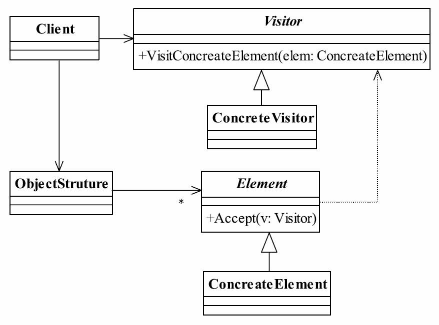

# 23.访问者模式

## 访问者模式的定义
访问者模式（Visitor Pattern）是一个相对简单的模式，其定义如下：Represent an operation to be performed on the elements of an object structure. Visitor lets you define a new operation without changing the classes of the elements on which it operates. （封装一些作用于某种数据结构中的各元素的操作，它可以在不改变数据结构的前提下定义作用于这些元素的新的操作。）



## 访问者模式的角色
● Visitor——抽象访问者
抽象类或者接口，声明访问者可以访问哪些元素，具体到程序中就是visit方法的参数定义哪些对象是可以被访问的。
● ConcreteVisitor——具体访问者
它影响访问者访问到一个类后该怎么干，要做什么事情。
● Element——抽象元素
接口或者抽象类，声明接受哪一类访问者访问，程序上是通过accept方法中的参数来定义的。
● ConcreteElement——具体元素
实现accept方法，通常是visitor.visit(this)，基本上都形成了一种模式了。
● ObjectStruture——结构对象
元素产生者，一般容纳在多个不同类、不同接口的容器，如List、Set、Map等，在项目中，一般很少抽象出这个角色。

## 实例

### 抽象访问者`IVisitor.java`

```java
public interface IVisitor {
    void visit(Employee employee);
}
```

### 抽象元素`Employee.java`

```java
@Data
public abstract class Employee {
    public Employee(String name, int degree, int salary, String sex) {
        this.name = name;
        this.degree = degree;
        this.salary = salary;
        this.sex = sex;
    }
    private String name;
    private int degree;
    private int salary;
    private String sex;
    public abstract void accept(IVisitor visitor1);
    public enum SexType {
        MALE("男性"), FEMALE("女性");
        SexType(String desc) {
            this.desc = desc;
        }
        String desc;
        public String getDesc() {
            return desc;
        }
    }
}
```

### 具体元素

#### `CommonEmployee.java`

```java
@Data
public class CommonEmployee extends Employee{
    private String job;
    public CommonEmployee(String name, int degree, int salary, String sex,String job) {
        super(name, degree, salary, sex);
        this.job=job;
    }
    @Override
    public void accept(IVisitor visitor1) {
        visitor1.visit(this);
    }
}
```

#### `ManagerEmployee.java`

```java
@Data
public class ManagerEmployee extends Employee {
    private String performance;
    public ManagerEmployee(String name, int degree, int salary, String sex, String performance) {
        super(name, degree, salary, sex);
        this.performance = performance;
    }
    @Override
    public void accept(IVisitor visitor1) {
        visitor1.visit(this);
    }
}
```

### 测试类`EmployeeTest.java`

```java
public class EmployeeTest {
    public static void main(String[] args) {
        Visitor visitor=new Visitor();
        Employee employee1 = new CommonEmployee("张三",2,1500,MALE.getDesc(),"普工");
        Employee employee2 = new CommonEmployee("李四",2,2500,MALE.getDesc(),"IT工程师");
        Employee employee3 = new CommonEmployee("Rose",2,3000,FEMALE.getDesc(),"焊工");
        Employee employee4 = new ManagerEmployee("Mary",2,3000,FEMALE.getDesc(),"总销售额500万");
        List<Employee> list= Arrays.asList(employee1,employee2,employee3,employee4);
        list.forEach(v->{
            v.accept(visitor);
        });
    }
}
```

输出:

```cmd
~~~~~~~~~~~~~~打印雇员张三的信息~~~~~~~~~~~~~~
雇员的性别：男性
雇员的工资：1500
雇员的级别：2
雇员的补偿金：15000
雇员的工作：普工
~~~~~~~~~~~~~~打印雇员李四的信息~~~~~~~~~~~~~~
雇员的性别：男性
雇员的工资：2500
雇员的级别：2
雇员的补偿金：25000
雇员的工作：IT工程师
~~~~~~~~~~~~~~打印雇员Rose的信息~~~~~~~~~~~~~~
雇员的性别：女性
雇员的工资：3000
雇员的级别：2
雇员的补偿金：30000
雇员的工作：焊工
~~~~~~~~~~~~~~打印雇员Mary的信息~~~~~~~~~~~~~~
雇员的性别：女性
雇员的工资：3000
雇员的级别：2
雇员的补偿金：60000
雇员的业绩：总销售额500万
```

看看这个程序是怎么实现的：
● 第一，通过循环遍历所有元素。
● 第二，每个员工对象都定义了一个访问者。
● 第三，员工对象把自己作为一个参数调用访问者visit方法。
● 第四，访问者调用自己内部的计算逻辑，计算出相应的数据和表格元素。
● 第五，访问者打印出报表和数据。

## 访问者模式的应用
### 访问者模式的优点
● 符合单一职责原则
具体元素角色也就是Employee抽象类的两个子类负责数据的加载，而Visitor类则负责报表的展现，两个不同的职责非常明确地分离开来，各自演绎变化。
● 优秀的扩展性
由于职责分开，继续增加对数据的操作是非常快捷的，例如，现在要增加一份给大老板的报表，这份报表格式又有所不同，直接在Visitor中增加一个方法，传递数据后进行整理打印。
● 灵活性非常高
例如，数据汇总，就以刚刚我们说的Employee的例子，如果我现在要统计所有员工的工资之和，怎么计算？把所有人的工资for循环加一遍？是个办法，那我再提个问题，员工工资×1.2，部门经理×1.4，总经理×1.8，然后把这些工资加起来，你怎么处理？1.2，1.4，1.8是什么？不是吧？！你没看到领导不论什么时候都比你拿得多，工资奖金就不说了，就是过节发个慰问券也比你多，就是这个系数在作祟。我们继续说你想怎么统计？使用for循环，然后使用instanceof来判断是员工还是经理？这可以解决，但不是个好办法，好办法是通过访问者模
式来实现，把数据扔给访问者，由访问者来进行统计计算。
### 访问者模式的缺点
● 具体元素对访问者公布细节
访问者要访问一个类就必然要求这个类公布一些方法和数据，也就是说访问者关注了其他类的内部细节，这是迪米特法则所不建议的。
● 具体元素变更比较困难
具体元素角色的增加、删除、修改都是比较困难的，就上面那个例子，你想想，你要是想增加一个成员变量，如年龄age，Visitor就需要修改，如果Visitor是一个还好办，多个呢？业务逻辑再复杂点呢？
● 违背了依赖倒置转原则
访问者依赖的是具体元素，而不是抽象元素，这破坏了依赖倒置原则，特别是在面向对象的编程中，抛弃了对接口的依赖，而直接依赖实现类，扩展比较难。

## 访问者模式的使用场景
● 一个对象结构包含很多类对象，它们有不同的接口，而你想对这些对象实施一些依赖于其具体类的操作，也就说是用迭代器模式已经不能胜任的情景。
● 需要对一个对象结构中的对象进行很多不同并且不相关的操作，而你想避免让这些操作“污染”这些对象的类。

