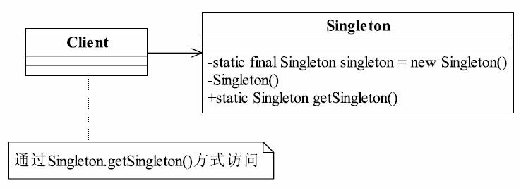

# 4.单例模式

单例模式（Singleton Pattern）是一个比较简单的模式，其定义如下：
Ensure a class has only one instance, and provide a global point of access to it.（确保某一个类只有一个实例，而且自行实例化并向整个系统提供这个实例。）



Singleton类称为单例类，通过使用private的构造函数确保了在一个应用中只产生一个实例，并且是自行实例化的（在Singleton中自己使用new Singleton()）。

## 饿汉式（静态变量）

```java
public class Emperor1 {
    private static final Emperor1 instance = new Emperor1();

    /**
     * 私有的构造方法，防止从外部new对象出来
     */
    private Emperor1() {
    }

    public static Emperor1 getInstance() {
        return instance;
    }
    public void say(){
        System.out.println("就我一个皇帝："+instance.hashCode());
    }
}
```

> 系统启动时就new了一个对象，消耗了一定的资源。不推荐。

## 饿汉式（静态代码块）

```java
public class Emperor2 {
    private static Emperor2 instance = null;
    static {
        instance = new Emperor2();
    }

    /**
     * 私有的构造方法，防止从外部new对象出来
     */
    private Emperor2() {
    }

    public static Emperor2 getInstance() {
        return instance;
    }

    public void say() {
        System.out.println("就我一个皇帝：" + instance.hashCode());
    }
}
```

> 系统启动时就new了一个对象，消耗了一定的资源。不推荐。

## 懒汉式（延迟加载）

```java
public class Emperor3 {
    private static Emperor3 instance = null;
    /**
     * 私有的构造方法，防止从外部new对象出来
     */
    private Emperor3() {
    }

    public static Emperor3 getInstance() {
        if (instance == null) {
            instance = new Emperor3();
        }
        return instance;
    }

    public void say() {
        System.out.println("就我一个皇帝：" + instance.hashCode());
    }
}
```

> 延迟加载，getInstance()才new对象，但在多线程下存在创建多个对象的问题。不推荐。

## 懒汉式（延迟加载，同步方法）

```java
public class Emperor4 {
    private static volatile Emperor4 instance = null;
    /**
     * 私有的构造方法，防止从外部new对象出来
     */
    private Emperor4() {
    }

    public static synchronized Emperor4 getInstance() {
        if (instance == null) {
            instance = new Emperor4();
        }
        return instance;
    }

    public void say() {
        System.out.println("就我一个皇帝：" + instance.hashCode());
    }
}
```

> 延迟加载，getInstance()才new对象，调用频繁时，会锁整个方法，性能消耗较大。不推荐。

## 懒汉式（延迟加载，同步代码块）

```java
public class Emperor5 {
    private static volatile Emperor5 instance = null;
    /**
     * 私有的构造方法，防止从外部new对象出来
     */
    private Emperor5() {
    }

    public static  Emperor5 getInstance() {
        if (instance == null) {
            synchronized (Emperor5.class) {
                instance = new Emperor5();
            }
        }
        return instance;
    }

    public void say() {
        System.out.println("就我一个皇帝：" + instance.hashCode());
    }
}
```

> 延迟加载，getInstance()才new对象，在多线程的情况下，存在创建多个对象的可能。不推荐。

## 懒汉式（延迟加载，同步代码块，双重检查）

```java
public class Emperor6 {
    private static volatile Emperor6 instance = null;
    /**
     * 私有的构造方法，防止从外部new对象出来
     */
    private Emperor6() {
    }

    public static Emperor6 getInstance() {
        if (instance == null) {
            synchronized (Emperor6.class) {
                if (instance == null) {
                    instance = new Emperor6();
                }
            }
        }
        return instance;
    }

    public void say() {
        System.out.println("就我一个皇帝：" + instance.hashCode());
    }
}
```

> 延迟加载，getInstance()才new对象，在多线程的情况下，也是安全的。推荐。

## 静态内部类

```java
public class Emperor7 {
    /**
     * 私有的构造方法，防止从外部new对象出来
     */
    private Emperor7() {
    }

    private static class LazyClass {
        private static final Emperor7 INSTANCE = new Emperor7();
    }

    public static Emperor7 getInstance() {
        return LazyClass.INSTANCE;
    }

    public void say() {
        System.out.println("就我一个皇帝：" + getInstance().hashCode());
    }
}
```

> 静态内部类不同于静态变量，它是在getInstance()时，加才载内部类，new一个新的对象。推荐。

## 枚举方法

```java
public enum Emperor8 {
    INSTANCE;
    public void say() {
        System.out.println("就我一个皇帝：" + INSTANCE.hashCode());
    }
}
```

> 利用枚举特性，但扩展性不好，代码简洁。推荐。

## 单例模式的应用
### 单例模式的优点
● 由于单例模式在内存中只有一个实例，减少了内存开支，特别是一个对象需要频繁地创建、销毁时，而且创建或销毁时性能又无法优化，单例模式的优势就非常明显。
● 由于单例模式只生成一个实例，所以减少了系统的性能开销，当一个对象的产生需要比较多的资源时，如读取配置、产生其他依赖对象时，则可以通过在应用启动时直接产生一个单例对象，然后用永久驻留内存的方式来解决（在Java EE中采用单例模式时需要注意JVM垃圾回收机制）。
● 单例模式可以避免对资源的多重占用，例如一个写文件动作，由于只有一个实例存在内存中，避免对同一个资源文件的同时写操作。
● 单例模式可以在系统设置全局的访问点，优化和共享资源访问，例如可以设计一个单例类，负责所有数据表的映射处理。

### 单例模式的缺点
● 单例模式一般没有接口，扩展很困难，若要扩展，除了修改代码基本上没有第二种途径可以实现。单例模式为什么不能增加接口呢？因为接口对单例模式是没有任何意义的，它要求“自行实例化”，并且提供单一实例、接口或抽象类是不可能被实例化的。当然，在特殊情况下，单例模式可以实现接口、被继承等，需要在系统开发中根据环境判断。
● 单例模式对测试是不利的。在并行开发环境中，如果单例模式没有完成，是不能进行测试的，没有接口也不能使用mock的方式虚拟一个对象。
● 单例模式与单一职责原则有冲突。一个类应该只实现一个逻辑，而不关心它是否是单例的，是不是要单例取决于环境，单例模式把“要单例”和业务逻辑融合在一个类中。

## 单例模式的使用场景
在一个系统中，要求一个类有且仅有一个对象，如果出现多个对象就会出现“不良反应”，可以采用单例模式，具体的场景如下：
● 要求生成唯一序列号的环境；
● 在整个项目中需要一个共享访问点或共享数据，例如一个Web页面上的计数器，可以不用把每次刷新都记录到数据库中，使用单例模式保持计数器的值，并确保是线程安全的；
● 创建一个对象需要消耗的资源过多，如要访问IO和数据库等资源；
● 需要定义大量的静态常量和静态方法（如工具类）的环境，可以采用单例模式（当然，也可以直接声明为static的方式）。