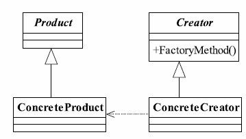

# 5.工厂方法模式

其定义为：
Define an interface for creating an object,but let subclasses decide which class to instantiate.Factory Method lets a class defer instantiation to subclasses.（定义一个用于创建对象的接口，让子类决定实例化哪一个类。工厂方法使一个类的实例化延迟到其子类。）



## 定义一个人`Human.java`

人的基本规范

```java
public interface Human {
    void talk();
    void color();
}
```

## 定义具体的人

`WhiteHuman.java`

```java
public class WhiteHuman implements Human {
    @Override
    public void talk() {
        System.out.println("白人会说话了，但说的是单字节的话！");
    }

    @Override
    public void color() {
        System.out.println("白色人种造出来了，皮肤颜色是白色的！");
    }
}
```

`YellowHuman.java`

```java
public class YellowHuman implements Human {
    @Override
    public void talk() {
        System.out.println("黄色人种会说话了，但说的是双字节的话！");
    }

    @Override
    public void color() {
        System.out.println("黄色人种造出来了，皮肤颜色是黄色的！");
    }
}
```

`BlackHuman.java`

```java
public class BlackHuman implements Human {
    @Override
    public void talk() {
        System.out.println("黑人会说话了，一般人听不懂！");
    }

    @Override
    public void color() {
        System.out.println("黑色人种造出来了，皮肤颜色是黑色的！");
    }
}
```

## 抽象工厂 `AbstractHumanFactory.java`

生产人的工厂规范

```java
public abstract class AbstractHumanFactory {
    public  abstract <T extends Human> T createHuman(Class<T> c);
}
```

## 遵守生产人规范的工厂`HumanFactory.java`

```java
public class HumanFactory extends AbstractHumanFactory {
    @Override
    public <T extends Human> T createHuman(Class<T> c) {
        Human human=null;
        try {
            human = (Human)Class.forName(c.getName()).newInstance();
        } catch (InstantiationException e) {
            e.printStackTrace();
        } catch (IllegalAccessException e) {
            e.printStackTrace();
        } catch (ClassNotFoundException e) {
            e.printStackTrace();
        }
        return (T)human;
    }
}
```

## 工厂方法模式的应用

### 工厂方法模式的优点
首先，良好的封装性，代码结构清晰。一个对象创建是有条件约束的，如一个调用者需要一个具体的产品对象，只要知道这个产品的类名（或约束字符串）就可以了，不用知道创建对象的艰辛过程，降低模块间的耦合。
其次，工厂方法模式的扩展性非常优秀。在增加产品类的情况下，只要适当地修改具体的工厂类或扩展一个工厂类，就可以完成“拥抱变化”。例如在我们的例子中，需要增加一个棕色人种，则只需要增加一个BrownHuman类，工厂类不用任何修改就可完成系统扩展。
再次，屏蔽产品类。这一特点非常重要，产品类的实现如何变化，调用者都不需要关心，它只需要关心产品的接口，只要接口保持不变，系统中的上层模块就不要发生变化。因为产品类的实例化工作是由工厂类负责的，一个产品对象具体由哪一个产品生成是由工厂类决定的。在数据库开发中，大家应该能够深刻体会到工厂方法模式的好处：如果使用JDBC连接数据库，数据库从MySQL切换到Oracle，需要改动的地方就是切换一下驱动名称（前提
条件是SQL语句是标准语句），其他的都不需要修改，这是工厂方法模式灵活性的一个直接案例。
最后，工厂方法模式是典型的解耦框架。高层模块值需要知道产品的抽象类，其他的实现类都不用关心，符合迪米特法则，我不需要的就不要去交流；也符合依赖倒置原则，只依赖产品类的抽象；当然也符合里氏替换原则，使用产品子类替换产品父类，没问题！

## 工厂方法模式的使用场景
首先，工厂方法模式是new一个对象的替代品，所以在所有需要生成对象的地方都可以使用，但是需要慎重地考虑是否要增加一个工厂类进行管理，增加代码的复杂度。
其次，需要灵活的、可扩展的框架时，可以考虑采用工厂方法模式。