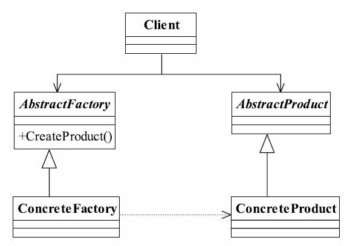

# 6.抽象工厂模式

## 抽象工厂模式的定义
抽象工厂模式（Abstract Factory Pattern）是一种比较常用的模式，其定义如下：
Provide an interface for creating families of related or dependent objects without specifying their concrete classes.（为创建一组相关或相互依赖的对象提供一个接口，而且无须指定它们的具体类。）



## `Human.java`产品的接口类、抽象类

```java
public interface Human {
    void talk();
    void color();
    void getSex();
}
```

`AbstractBlackHuman.java`

```java
public abstract class AbstractBlackHuman implements Human {
    @Override
    public void talk() {
        System.out.println("黑人会说话了，一般人听不懂！");
    }

    @Override
    public void color() {
        System.out.println("黑色人种造出来了，皮肤颜色是黑色的！");
    }
}
```

`AbstractWhiteHuman.java`

```java
public abstract class AbstractWhiteHuman implements Human {
    @Override
    public void talk() {
        System.out.println("白人会说话了，但说的是单字节的话！");
    }

    @Override
    public void color() {
        System.out.println("白色人种造出来了，皮肤颜色是白色的！");
    }
}
```

`AbstractYellowHuman.java`

```java
public abstract class AbstractYellowHuman implements Human {
    @Override
    public void talk() {
        System.out.println("黄色人种会说话了，但说的是双字节的话！");
    }

    @Override
    public void color() {
        System.out.println("黄色人种造出来了，皮肤颜色是黄色的！");
    }
}
```

## 真正的产品

`FemaleBlackHuman.java`

```java
public class FemaleBlackHuman extends AbstractBlackHuman {
    //黑人人女性
    @Override
    public void getSex() {
        System.out.println("黑人女性");
    }
}
```

`FemaleWhiteHuman.java`

```java
public class FemaleWhiteHuman extends AbstractWhiteHuman {
    //白人人女性
    @Override
    public void getSex() {
        System.out.println("白人女性");
    }
}
```

`FemaleYellowHuman.java`

```java
public class FemaleYellowHuman extends AbstractYellowHuman {
    //黄人女性
    @Override
    public void getSex() {
        System.out.println("黄人女性");
    }
}
```

`MaleBlackHuman.java`

```java
public class MaleBlackHuman extends AbstractBlackHuman {
    //黑人男性
    @Override
    public void getSex() {
        System.out.println("黑人男性");
    }
}
```

`MaleWhiteHuman.java`

```java
public class MaleWhiteHuman extends AbstractWhiteHuman {
    //白人男性
    @Override
    public void getSex() {
        System.out.println("白人男性");
    }
}
```

`MaleYellowHuman.java`

```java
public class MaleYellowHuman extends AbstractYellowHuman {
    //黄人男性
    @Override
    public void getSex() {
        System.out.println("黄人男性");
    }
}
```

## `HumanFactory.java`抽象工厂接口

```java
public interface HumanFactory {
    //制造一个黄色人种
     Human createYellowHuman();
    //制造一个白色人种
     Human createWhiteHuman();
    //制造一个黑色人种
     Human createBlackHuman();
}
```

## 工厂实现类

`FemaleHumanFactory.java`

```java
public class FemaleHumanFactory implements HumanFactory {
    @Override
    public Human createYellowHuman() {
        return new FemaleYellowHuman();
    }

    @Override
    public Human createWhiteHuman() {
        return new FemaleWhiteHuman();
    }

    @Override
    public Human createBlackHuman() {
        return new FemaleBlackHuman();
    }
}
```

`MaleHumanFactory.java`

```java
public class MaleHumanFactory implements HumanFactory {
    @Override
    public Human createYellowHuman() {
        return new MaleYellowHuman();
    }

    @Override
    public Human createWhiteHuman() {
        return new MaleWhiteHuman();
    }

    @Override
    public Human createBlackHuman() {
        return new MaleBlackHuman();
    }
}
```

## 抽象工厂模式的应用
### 抽象工厂模式的优点
● 封装性

每个产品的实现类不是高层模块要关心的，它要关心的是什么？是接口，是抽象，它不关心对象是如何创建出来，这由谁负责呢？工厂类，只要知道工厂类是谁，我就能创建出一个需要的对象，省时省力，优秀设计就应该如此。
● 产品族内的约束为非公开状态。

这样的生产过程对调用工厂类的高层模块来说是透明的，它不需要知道这个约束，具体的产品族内的约束是在工厂内实现的。

### 抽象工厂模式的缺点
抽象工厂模式的最大缺点就是产品族扩展非常困难，为什么这么说呢？我们以通用代码为例，如果要增加一个产品C，也就是说产品家族由原来的2个增加到3个，看看我们的程序有多大改动吧！抽象类AbstractCreator要增加一个方法createProductC()，然后两个实现类都要修改，想想看，这严重违反了开闭原则，而且我们一直说明抽象类和接口是一个契约。改变契约，所有与契约有关系的代码都要修改，那么这段代码叫什么？叫“有毒代码”，——只要与这段代码有关系，就可能产生侵害的危险！

## 抽象工厂模式的使用场景
抽象工厂模式的使用场景定义非常简单：一个对象族（或是一组没有任何关系的对象）都有相同的约束，则可以使用抽象工厂模式。什么意思呢？例如一个文本编辑器和一个图片处理器，都是软件实体，但是 * nix下的文本编辑器和Windows下的文本编辑器虽然功能和界面都相同，但是代码实现是不同的，图片处理器也有类似情况。也就是具有了共同的约束条件：操作系统类型。于是我们可以使用抽象工厂模式，产生不同操作系统下的编辑器和图片
处理器。

## 依赖抽象原则

* 变量不要持有某个具体类的引用
* 不要让类继承自具体类，要继承自抽象类或接口
* 不要覆盖基类中已实现的方法