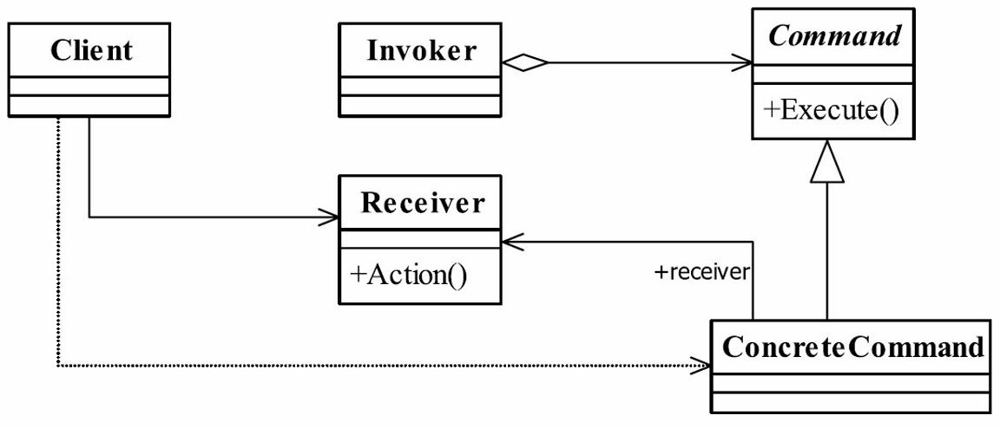

# 7.命令模式

命令模式是一个高内聚的模式，其定义为：Encapsulate a request as an object,thereby letting you parameterize clients with different requests,queue or log requests,and support undoable operations.（将一个请求封装成一个对象，从而让你使用不同的请求把客户端参数化，对请求排队或者记录请求日志，可以提供命令的撤销和恢复功能。）



## 三个角色
● Receive接收者角色
该角色就是干活的角色，命令传递到这里是应该被执行的。
● Command命令角色
需要执行的所有命令都在这里声明。
● Invoker调用者角色
接收到命令，并执行命令。命令模式比较简单，但是在项目中非常频繁地使用，因为它的封装性非常好

## Client

`Light.java`

```java
@Data
public class Light {
    private String name;
    public Light(String name){this.name=name;}

    public void on() {
        System.out.println(this.getName()+" 打开了");
    }
    public void off() {
        System.out.println(this.getName()+" 关闭了");
    }
}
```

`Stereo.java`

```java
@Data
public class Stereo {
    public static final long MAX_VOLUME = 10L;
    int volume = 0;


    void on() {
        System.out.println("打开音响了");
    }

    void off() {
        System.out.println("关闭音响了");
    }

    void increaseVolume() {
        if (volume < MAX_VOLUME) {
            volume++;
        }
        System.out.println("当前音量：" + volume);
    }

    void decreaseVolume() {
        if (volume > 0) {
            volume--;
        }
        System.out.println("当前音量：" + volume);
    }
}
```

## Commander

`Commander.java`

```java
public interface Commander {
    void execute();
    void undo();
}
```

## Concrete Command 

持有client, 根据Command用途执行client的方法

`LightOffCommand.java`

```java
@Data
public class LightOffCommand implements Commander {
    Light light;

    public LightOffCommand(Light light) {
        this.light = light;
    }

    @Override
    public void execute() {
        light.off();
    }

    @Override
    public void undo() {
        light.on();
    }
}
```

`LightOnCommand.java`

```java
@Data
public class LightOnCommand implements Commander {
    Light light;

    public LightOnCommand(Light light) {
        this.light = light;
    }

    @Override
    public void execute() {
        light.on();
    }

    @Override
    public void undo() {
        light.off();
    }

}
```

`StereoDecreaseCommand.java`

```java
public class StereoDecreaseCommand implements Commander {
    private Stereo stereo;

    public StereoDecreaseCommand(Stereo stereo) {
        this.stereo = stereo;
    }

    @Override
    public void execute() {


        this.stereo.decreaseVolume();
    }

    @Override
    public void undo() {
        this.stereo.increaseVolume();
    }
}
```

`StereoIncreaseCommand.java`

```java
public class StereoIncreaseCommand implements Commander {
    private Stereo stereo;

    public StereoIncreaseCommand(Stereo stereo) {
        this.stereo = stereo;
    }

    @Override
    public void execute() {


        this.stereo.increaseVolume();
    }

    @Override
    public void undo() {
        this.stereo.decreaseVolume();
    }
}
```

`StereoOffCommand.java`

```java
public class StereoOffCommand implements Commander {
    private Stereo stereo;

    public StereoOffCommand(Stereo stereo) {
        this.stereo = stereo;
    }

    @Override
    public void execute() {
        this.stereo.off();
    }

    @Override
    public void undo() {
        this.stereo.on();
    }
}
```

`StereoOnCommand.java`

```java
public class StereoOnCommand implements Commander {
    private Stereo stereo;

    public StereoOnCommand(Stereo stereo) {
        this.stereo = stereo;
    }

    @Override
    public void execute() {
        this.stereo.on();
    }

    @Override
    public void undo() {
        this.stereo.off();
    }
}
```

`NoCommand.java`

```java
public class NoCommand implements Commander {
    @Override
    public void execute() {
    }

    @Override
    public void undo() {

    }
}
```

`GroupCommander.java`

```java
public class GroupCommander implements Commander {
    List<Commander> cmds;
    Stack<List<Commander>> stacks=new Stack<>();
    public GroupCommander(List<Commander> objects) {
        cmds=objects;
    }

    @Override
    public void execute() {
        if(null!=cmds&&cmds.size()>0) {
            cmds.forEach(cmd->{
                cmd.execute();
            });
            stacks.push(cmds);
        }
    }

    @Override
    public void undo() {
        stacks.pop().stream().forEach(cmd->{
            cmd.undo();
        });
    }
}
```


## 调用者Invoker类`Controller.java`

```java
@Data
public class Controller {
    Stack<Commander> stack = new Stack<>();
    Commander[] listOn;
    Commander[] listOff;

    public Controller() {
        listOn = new Commander[5];
        listOff = new Commander[5];

        NoCommand noCommand = new NoCommand();
        for (int idx = 0; idx < 5; idx++) {
            listOn[idx] = noCommand;
            listOff[idx] = noCommand;
        }
    }

    public void setCommander(int idx, Commander onCommand, Commander offCommand) {
        listOn[idx] = onCommand;
        listOff[idx] = offCommand;
    }

    public void onButton(int idx) {
        listOn[idx].execute();
        stack.push(listOn[idx]);
    }

    public void offButton(int idx) {
        listOff[idx].execute();
    }

    public void undo() {
        stack.pop().undo();
    }
}
```

## 测试类`CommanderTest.java`

```java
public class CommanderTest {
    public static void main(String[] args) {
        Light kitchenLight = new Light("厨房的灯");
        Commander kitchenLightOnCommander = new LightOnCommand(kitchenLight);
        Commander kitchenLightOffCommander = new LightOffCommand(kitchenLight);
        Light LivingRoomLight = new Light("客厅的灯");
        Commander LivingRoomLightOnCommander = new LightOnCommand(LivingRoomLight);
        Commander LivingRoomLightOffCommander = new LightOffCommand(LivingRoomLight);
        Stereo stereo=new Stereo();
        Commander stereoOnCommand = new StereoOnCommand(stereo);
        Commander stereoOffCommand = new StereoOffCommand(stereo);
        Commander stereoIncreaseCommand = new StereoIncreaseCommand(stereo);
        Commander stereoDecreaseCommand = new StereoDecreaseCommand(stereo);
        Commander lightOnCommander = new GroupCommander(Arrays.asList(kitchenLightOnCommander,LivingRoomLightOnCommander,stereoOnCommand));
        Commander lightOffCommander = new GroupCommander(Arrays.asList(kitchenLightOffCommander,LivingRoomLightOffCommander,stereoOffCommand));
        Controller controller = new Controller();
        controller.setCommander(0,kitchenLightOnCommander,kitchenLightOffCommander);
        controller.setCommander(1,LivingRoomLightOnCommander,LivingRoomLightOffCommander);
        controller.setCommander(2,stereoOnCommand,stereoOffCommand);
        controller.setCommander(3,stereoIncreaseCommand,stereoDecreaseCommand);
        controller.setCommander(4,lightOnCommander,lightOffCommander);
        controller.onButton(0);
        controller.offButton(0);
        controller.onButton(1);
        controller.offButton(1);
        controller.onButton(2);
        controller.offButton(2);
        controller.onButton(3);
        controller.offButton(3);
        controller.undo();
        controller.undo();
        System.out.println("组合命令：");
        controller.onButton(4);
        controller.undo();
    }
}
```

输出

```cmd
厨房的灯 打开了
厨房的灯 关闭了
客厅的灯 打开了
客厅的灯 关闭了
打开音响了
关闭音响了
当前音量：1
当前音量：0
当前音量：0
关闭音响了
组合命令：
厨房的灯 打开了
客厅的灯 打开了
打开音响了
厨房的灯 关闭了
客厅的灯 关闭了
关闭音响了
```

## 命令模式的应用
### 命令模式的优点
● 类间解耦
调用者角色与接收者角色之间没有任何依赖关系，调用者实现功能时只需调用Command抽象类的execute方法就可以，不需要了解到底是哪个接收者执行。
● 可扩展性
Command的子类可以非常容易地扩展，而调用者Invoker和高层次的模块Client不产生严重的代码耦合。
● 命令模式结合其他模式会更优秀
命令模式可以结合责任链模式，实现命令族解析任务；结合模板方法模式，则可以减少Command子类的膨胀问题。

### 命令模式的缺点
命令模式也是有缺点的，请看Command的子类：如果有N个命令，问题就出来了，Command的子类就可不是几个，而是N个，这个类膨胀得非常大，这个就需要读者在项目中慎重考虑使用。

## 命令模式的使用场景
只要你认为是命令的地方就可以采用命令模式，例如，在GUI开发中，一个按钮的点击是一个命令，可以采用命令模式；模拟DOS命令的时候，当然也要采用命令模式；触发－反馈机制的处理等。

