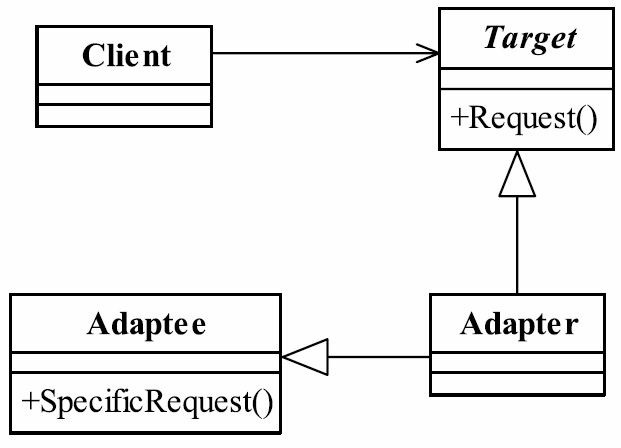

# 8.适配器模式

适配器模式（Adapter Pattern）的定义如下：
Convert the interface of a class into another interface clients expect.Adapter lets classes work together that couldn't otherwise because of incompatible interfaces.（将一个类的接口变换成客户端所期待的另一种接口，从而使原本因接口不匹配而无法在一起工作的两个类能够在一起工作。）
适配器模式又叫做变压器模式，也叫做包装模式（Wrapper），但是包装模式可不止一个，还包括装饰模式。



## 适配器模式的三个角色。
● Target目标角色
该角色定义把其他类转换为何种接口，也就是我们的期望接口。
● Adaptee源角色
你想把谁转换成目标角色，这个“谁”就是源角色，它是已经存在的、运行良好的类或对象，经过适配器角色的包装，它会成为一个崭新、靓丽的角色。
● Adapter适配器角色
适配器模式的核心角色，其他两个角色都是已经存在的角色，而适配器角色是需要新建立的，它的职责非常简单：把源角色转换为目标角色，怎么转换？通过继承或是类关联的方式。

## 目标接口`Duck.java`

```java
public interface Duck {
    void quack();
    void go();
}
```

## 目标的实现类`GreenHeadDuck.java`

```java
public class GreenHeadDuck implements Duck {
    @Override
    public void quack() {
        System.out.println("鸭子嘎嘎叫");
    }

    @Override
    public void go() {
        System.out.println("鸭子飞很短的距离");
    }
}
```

## 需要转换的接口`Turkey.java`

```java
public interface Turkey {
    void sing();

    void fly();
}
```

## 需要转换的实现类`WildTurkey.java`

```java
public class WildTurkey implements Turkey {
    @Override
    public void sing() {
        System.out.println("火鸡唱歌了");
    }

    @Override
    public void fly() {
        System.out.println("火鸡长距离飞了");
    }
}
```

## 通过继承转换成目标类`WildFakeDuck.java`

```java
public class WildFakeDuck extends WildTurkey implements Duck {
    @Override
    public void quack() {
        super.sing();
    }

    @Override
    public void go() {
        super.fly();
    }
}
```

## 类关联转换成目标类`WildFakeDuck2.java`

```java
public class WildFakeDuck2 implements Duck {
    Turkey turkey;
    public WildFakeDuck2(Turkey turkey){
        this.turkey=turkey;
    }
    @Override
    public void quack() {
        turkey.sing();
    }

    @Override
    public void go() {
        turkey.fly();
    }
}
```

## 测试类`DuckTest.java`

```java
public class DuckTest {
    public static void main(String[] args) {
        Duck greenHeadDuck = new GreenHeadDuck();
        Turkey turkey=new WildTurkey();
        turkey.fly();
        turkey.sing();
        greenHeadDuck.go();
        greenHeadDuck.quack();
        System.out.println("~~~~~适配模式：继承~~~~~");
        WildFakeDuck wildFakeDuck = new WildFakeDuck();
        wildFakeDuck.go();
        wildFakeDuck.quack();
        System.out.println("~~~~~适配模式：组合~~~~~");
        WildFakeDuck2 wildFakeDuck2 = new WildFakeDuck2(turkey);
        wildFakeDuck2.go();
        wildFakeDuck2.quack();
    }
}
```

输出

```cmd
鸭子飞很短的距离
鸭子嘎嘎叫
火鸡长距离飞了
火鸡唱歌了
~~~~~适配模式：继承~~~~~
火鸡长距离飞了
火鸡唱歌了
~~~~~适配模式：组合~~~~~
火鸡长距离飞了
火鸡唱歌了
```

## 适配器模式的应用
### 适配器模式的优点
● 适配器模式可以让两个没有任何关系的类在一起运行，只要适配器这个角色能够搞定他们就成。
● 增加了类的透明性
想想看，我们访问的Target目标角色，但是具体的实现都委托给了源角色，而这些对高层次模块是透明的，也是它不需要关心的。
● 提高了类的复用度
当然了，源角色在原有的系统中还是可以正常使用，而在目标角色中也可以充当新的演员。
● 灵活性非常好
某一天，突然不想要适配器，没问题，删除掉这个适配器就可以了，其他的代码都不用修改，基本上就类似一个灵活的构件，想用就用，不想就卸载。

## 适配器模式的使用场景
适配器应用的场景只要记住一点就足够了：你有动机修改一个已经投产中的接口时，适配器模式可能是最适合你的模式。比如系统扩展了，需要使用一个已有或新建立的类，但这个类又不符合系统的接口，怎么办？使用适配器模式。