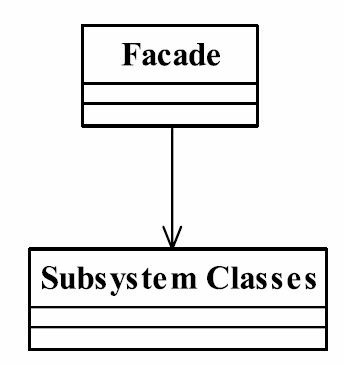

# 9.外观模式

门面模式（Facade Pattern）也叫做外观模式，是一种比较常用的封装模式，其定义如下：
Provide a unified interface to a set of interfaces in a subsystem.Facade defines a higher-level interface that makes the subsystem easier to use.（要求一个子系统的外部与其内部的通信必须通过一个统一的对象进行。门面模式提供一个高层次的接口，使得子系统更易于使用。）
门面模式注重“统一的对象”，也就是提供一个访问子系统的接口，除了这个接口不允许有任何访问子系统的行为发生。



## 门面模式的角色
● Facade门面角色
客户端可以调用这个角色的方法。此角色知晓子系统的所有功能和责任。一般情况下，本角色会将所有从客户端发来的请求委派到相应的子系统去，也就说该角色没有实际的业务逻辑，只是一个委托类。
● subsystem子系统角色
可以同时有一个或者多个子系统。每一个子系统都不是一个单独的类，而是一个类的集合。子系统并不知道门面的存在。对于子系统而言，门面仅仅是另外一个客户端而已。

## Facade门面角色

### `Curtain.java`

```java
public class Curtain {
    private Curtain() {
    }

    private static class LazyClazz {
        private static final Curtain INSTANCE = new Curtain();
    }

    public static Curtain getInstance() {
        return LazyClazz.INSTANCE;
    }

    void fell() {
        System.out.println("幕布降下来了");
    }

    void rise() {
        System.out.println("幕布上升了");
    }
}
```

### `DvdPlayer.java`

```java
public class DvdPlayer {
    private DvdPlayer() {
    }
    private static class LazyClazz {
        private static final DvdPlayer INSTANCE = new DvdPlayer();
    }
    public static DvdPlayer getInstance() {
        return LazyClazz.INSTANCE;
    }
    public void play() {
        System.out.println("电影开始播放");
    }
    public void close() {
        System.out.println("电影播放结束");
    }
    public void pause() {
        System.out.println("电影播放暂停");
    }
}
```

### `Popcorn.java`

```java
public class Popcorn {
    private Popcorn() {
    }

    private static class LazyClazz {
        private static final Popcorn INSTANCE = new Popcorn();
    }

    public static Popcorn getInstance() {
        return LazyClazz.INSTANCE;
    }

    void buy() {
        System.out.println("购买好爆米花，找好座位，开吃");
    }

    void throwRubbish() {
        System.out.println("扔掉爆米花包装盒到垃圾桶");
    }
}
```

### `Projector.java`

```java
public class Projector {
    private Projector() {
    }

    private static class LazyClazz {
        private static final Projector INSTANCE = new Projector();
    }

    public static Projector getInstance() {
        return LazyClazz.INSTANCE;
    }

    void on() {
        System.out.println("投影仪打开");
    }

    void off() {
        System.out.println("投影仪关闭");
    }

    void adjust() {
        System.out.println("投影仪调整");
    }
}
```

### `Stereo.java`

```java
public class Stereo {
    private Stereo() {
    }

    private static class LazyClazz {
        private static final Stereo INSTANCE = new Stereo();
    }

    public static Stereo getInstance() {
        return LazyClazz.INSTANCE;
    }

    void on() {
        System.out.println("影响打开了");
    }

    void off() {
        System.out.println("影响关闭了");
    }
}
```

## Subsystem子系统角色`HomeTheatreFacade.java`

```java
public class HomeTheatreFacade {
    Curtain curtain;
    DvdPlayer dvdPlayer;
    Popcorn popcorn;
    Stereo stereo;
    Projector projector;
    public HomeTheatreFacade() {
        curtain = Curtain.getInstance();
        dvdPlayer = DvdPlayer.getInstance();
        popcorn = Popcorn.getInstance();
        stereo = Stereo.getInstance();
        projector=Projector.getInstance();
    }
    public void read() {
        curtain.fell();
        popcorn.buy();
        stereo.on();
        projector.on();
        projector.adjust();
    }
    public void play() {
        dvdPlayer.play();

    }
    public void shutdown() {
        stereo.off();
        dvdPlayer.close();
        curtain.rise();
        popcorn.throwRubbish();
        projector.off();
    }
}
```

## 测试类`HomeTheatreFacadeTest.java`

```java
public class HomeTheatreFacadeTest {
    public static void main(String[] args) {
        HomeTheatreFacade homeTheatre = new HomeTheatreFacade();
        System.out.println("~~~~~~~~~~~~准备工作~~~~~~~~~~~~");
        homeTheatre.read();
        System.out.println("~~~~~~~~~~~~正式观影~~~~~~~~~~~~");
        homeTheatre.play();
        System.out.println("~~~~~~~~~~~~观影结束~~~~~~~~~~~~");
        homeTheatre.shutdown();
    }
}
```

输出：

```cmd
~~~~~~~~~~~~准备工作~~~~~~~~~~~~
幕布降下来了
购买好爆米花，找好座位，开吃
影响打开了
投影仪打开
投影仪调整
~~~~~~~~~~~~正式观影~~~~~~~~~~~~
电影开始播放
~~~~~~~~~~~~观影结束~~~~~~~~~~~~
影响关闭了
电影播放结束
幕布上升了
扔掉爆米花包装盒到垃圾桶
投影仪关闭
```

## 门面模式的应用
### 门面模式的优点
门面模式有如下优点。
● 减少系统的相互依赖
想想看，如果我们不使用门面模式，外界访问直接深入到子系统内部，相互之间是一种强耦合关系，你死我就死，你活我才能活，这样的强依赖是系统设计所不能接受的，门面模式的出现就很好地解决了该问题，所有的依赖都是对门面对象的依赖，与子系统无关。
● 提高了灵活性
依赖减少了，灵活性自然提高了。不管子系统内部如何变化，只要不影响到门面对象，任你自由活动。
● 提高安全性
想让你访问子系统的哪些业务就开通哪些逻辑，不在门面上开通的方法，你休想访问到。

### 门面模式的缺点
门面模式最大的缺点就是不符合开闭原则，对修改关闭，对扩展开放，看看我们那个门面对象吧，它可是重中之重，一旦在系统投产后发现有一个小错误，你怎么解决？完全遵从开闭原则，根本没办法解决。继承？覆写？都顶不上用，唯一能做的一件事就是修改门面角色的代码，这个风险相当大，这就需要大家在设计的时候慎之又慎，多思考几遍才会有好收获。

## 门面模式的使用场景
● 为一个复杂的模块或子系统提供一个供外界访问的接口
● 子系统相对独立——外界对子系统的访问只要黑箱操作即可比如利息的计算问题，没有深厚的业务知识和扎实的技术水平是不可能开发出该子系统的，但是对于使用该系统的开发人员来说，他需要做的就是输入金额以及存期，其他的都不用关心，返回的结果就是利息，这时候，门面模式是非使用不可了。
● 预防低水平人员带来的风险扩散
比如一个低水平的技术人员参与项目开发，为降低个人代码质量对整体项目的影响风险，一般的做法是“画地为牢”，只能在指定的子系统中开发，然后再提供门面接口进行访问操作。

