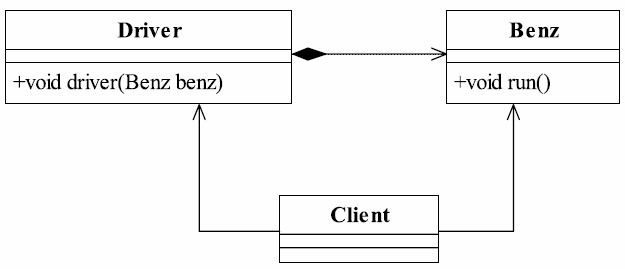
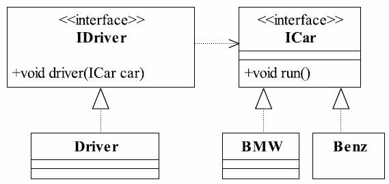
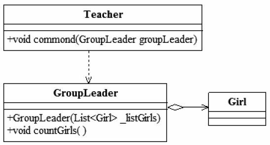
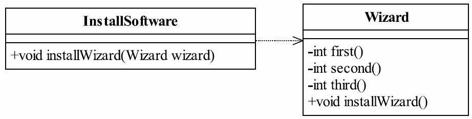
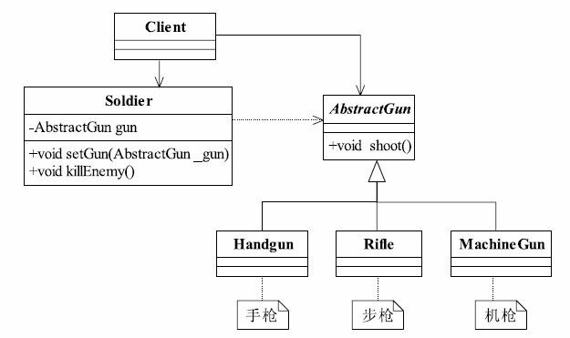
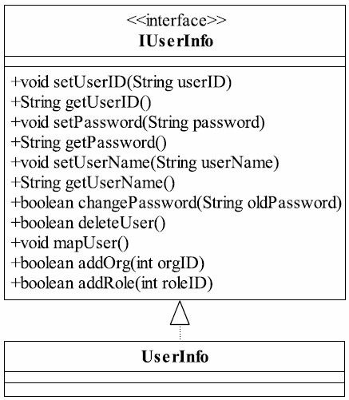
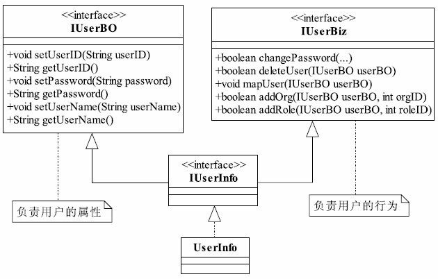
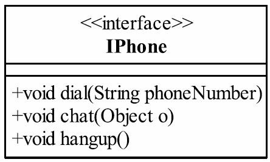
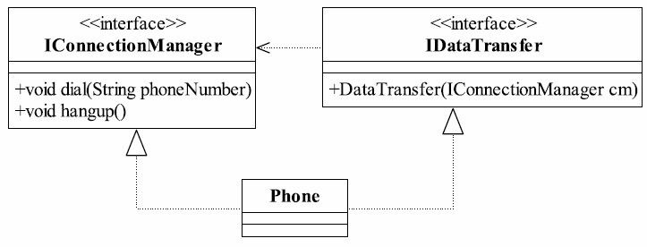

# 设计模式总结

### 什么是模式

在某些场景下，对某类问题的某种通用解决方案

## 三个分类

### 创建型模式

对象实例化的模式，创建型模式解耦了对象的实例化过程

#### 简单工厂

一个工厂类根据传入的参数决定创建哪一种产品类的实例

#### 工厂方法

定义一个创建对象的接口，让子类决定实例化哪一个类

#### 抽象工厂

创建相关或依赖对象的家族，而无需明确指定具体的类

#### 单例模式

某个类只有一个实例，提供一个全局访问点

#### 生成器模式

封装一个复杂对象的构建过程，并可以按步骤构造

#### 原型模式

通过复制现有的实例来创建新的实例

### 结构型模式

把类或对象结合在一起形成更大的结构

#### 适配器模式

将一个类的方法接口转换成客户希望的另外一个接口

#### 组合模式

将对象的组合成树形结构以表示“部分-整体”的层次结构

#### 装饰模式

动态地给对象添加新的功能

#### 代理模式

为其它对象提供一个代理以控制对这个对象的访问

#### 绳量模式（享元模式）

通过共享技术有效的支持大量细粒度的对象

#### 外观模式

提供统一的方法来访问子系统的一群接口

#### 桥接模式

将抽象部分与它的实现部分分离，使用它们都可以独立的变化

### 行为型模式

类和对象如何交互，及划分责任和算法

#### 模板模式

定义一个算法结构，而将一些步骤延迟到子类中实现。

#### 解释器模式

给定一个语言，定义它的文法的一种表示，并定义一个解释器

#### 策略模式

定义一系列的算法，把它们封装起来，并且使它们可相互替换

#### 状态模式

允许一个对象在其内部状态改变时改变它的行为

#### 观察者模式

对象间的一对多的依赖关系

#### 备忘录模式

在不破坏封装性的前提下，保存对象的内部状态

#### 中介者模式

用一个中介对象来封装一系列的对象的交互

#### 命令模式

将命令请求封装为一个对象，使用得可用不同的请求来进行参数化

#### 访问者模式

在不改变数据结构的前提下，增加作用于一组对象元素新的功能

#### 责任链

请求发送者和接收者之间解耦，使得多个对象都有机会处理这个请求

#### 迭代器

一种遍历访问聚合对象中各个元素的方法，不暴露该对象的内部结构。

## 对象设计的6大原则

### 组合复用原则

多用组合，少用继承

找到变化的部分，抽象，封装变化

区分has-A与is-A

> 策略模式

### 依赖倒置原则

Dependence inversion principle DIP

High level modules should not depend upon low level modules.Both should depend upon abstractions.Abstractions should not depend upon details.Details should depend upon abstractions.
翻译过来，包含三层含义：
● 高层模块不应该依赖低层模块，两者都应该依赖其抽象；
● 抽象不应该依赖细节；
● 细节应该依赖抽象。

依赖：成员变量、方法参数、返回值

要依赖于抽象，不要依赖于具体

高层模块不应该依赖低层模块，二者都应该依赖其抽象

抽象不应该依赖具体，具体应该依赖抽象

针对接口编程，不要针对实现编程

#### 依赖的三种写法

1. 构造函数传递依赖对象
2. Setter方法传递依赖对象
3. 接口声明依赖对象

> 以抽象为基础搭建的结构比具体类搭建的结构要稳定的多
>
> 在java中，抽象指的是接口或抽象类，具体就是具体的实现类
>
>  策略模式

#### 最佳实践
依赖倒置原则的本质就是通过抽象（接口或抽象类）使各个类或模块的实现彼此独立，不互相影响，实现模块间的松耦合，我们怎么在项目中使用这个规则呢？只要遵循以下的几个规则就可以：
● 每个类尽量都有接口或抽象类，或者抽象类和接口两者都具备
这是依赖倒置的基本要求，接口和抽象类都是属于抽象的，有了抽象才可能依赖倒置。
● 变量的表面类型尽量是接口或者是抽象类
很多书上说变量的类型一定要是接口或者是抽象类，这个有点绝对化了，比如一个工具类，xxxUtils一般是不需要接口或是抽象类的。还有，如果你要使用类的clone方法，就必须使用实现类，这个是JDK提供的一个规范。
● 任何类都不应该从具体类派生
如果一个项目处于开发状态，确实不应该有从具体类派生出子类的情况，但这也不是绝对的，因为人都是会犯错误的，有时设计缺陷是在所难免的，因此只要不超过两层的继承都是可以忍受的。特别是负责项目维护的同志，基本上可以不考虑这个规则，为什么？维护工作基本上都是进行扩展开发，修复行为，通过一个继承关系，覆写一个方法就可以修正一个很大的Bug，何必去继承最高的基类呢？（当然这种情况尽量发生在不甚了解父类或者无法获得父类代码的情况下。）
● 尽量不要覆写基类的方法
如果基类是一个抽象类，而且这个方法已经实现了，子类尽量不要覆写。类间依赖的是抽象，覆写了抽象方法，对依赖的稳定性会产生一定的影响。
● 结合里氏替换原则使用
里氏替换原则，父类出现的地方子类就能出现，再结合本章的讲解，我们可以得出这样一个通俗的规则： 接口负责定义public属性和方法，并且声明与其他对象的依赖关系，抽象类负责公共构造部分的实现，实现类准确的实现业务逻辑，同时在适当的时候对父类进行细化。

### 开闭原则

 Open Closed Principle：开闭原则

Software entities like classes,modules and functions should be open for extension but closed for modifications.（一个软件实体如类、模块和函数应该对扩展开放，对修改关闭。）

对扩展开放，对修改关闭

通过扩展已有软件系统，可以提供新的功能

修改的关闭，保证稳定性和延续性

> 注意　开闭原则对扩展开放，对修改关闭，并不意味着不做任何修改，低层模块的变更，必然要有高层模块进行耦合，否则就是一个孤立无意义的代码片段。

### 迪米特法则

Law of Demeter LoD 

Least knowledge principle LKP 最小知识原则

1. 只和朋友交流

   一个对象应该与其他对象保持最少的了解，只与朋友交谈成员变量，方法参数，方法返回值中需要的类为直接朋友类与类之间的关系越密切了解越多，耦合度越大

   

2. 朋友间也是有距离的

   

3. 是自己的就是自己的
在实际应用中经常会出现这样一个方法：放在本类中也可以，放在其他类中也没有错，那怎么去衡量呢？你可以坚持这样一个原则：如果一个方法放在本类中，既不增加类间关系，也对本类不产生负面影响，那就放置在本类中。
4. 谨慎使用Serializable

尽量降低类与类之间的耦合

> 外观模式、中介者模式
>
> 接口隔离原则：一个类对另一个类的依赖应该建立在最小的接口上

### 里氏替换原则

Liskov subsititution principle LSP

有两种定义：
● 第一种定义，也是最正宗的定义：If for each object o1 of type S there is an object o2 of type T such that for all programs P defined in terms of T,the behavior of P is unchanged when o1 is substituted for o2 then S is a subtype of T.（如果对每一个类型为S的对象o1，都有类型为T的对象o2，使得以T定义的所有程序P在所有的对象o1都代换成o2时，程序P的行为没有发生变化，那么类型S是类型T的子类型。）
● 第二种定义：Functions that use pointers or references to base classes must be able to use objects of derived classes without knowing it.（所有引用基类的地方必须能透明地使用其子类的对象。）
第二个定义是最清晰明确的，通俗点讲，只要父类能出现的地方子类就可以出现，而且替换为子类也不会产生任何错误或异常，使用者可能根本就不需要知道是父类还是子类。但是，反过来就不行了，有子类出现的地方，父类未必就能适应。

1. 子类必须完全实现父类的方法

   

2. 子类可以有自己的个性

3. 覆盖或实现父类的方法时输入参数可以被放大

4. 覆写或实现父类的方法时输出结果可以被缩小

所有引用基类的地方必须能透明地使用其子类对象

子类在扩展父类功能时不能破坏父类原有的功能

使用继承时，遵循里氏替换原则：

子类可以实现父类的抽象方法，但不能覆盖父类的非抽象方法。

当子类重载父类方法时，方法的形参要比父类方法的参数更宽松

当子类实现父类的抽象方法时，方法的返回值要比父类更严格

> 里氏替换原则是设计整个继承体系的原则

### 单一职责原则

single responsibility principle

类应该只有一个导致类变更的理由

即一个类只负责一项职责

#### Role-based Access Control RBAC

#### Phone

IPhone这个接口可不是只有一个职责，它包含了两个职责：一个是协议管理，一个是数据传送。

dial()和hangup()两个方法实现的是协议管理，分别负责拨号接通和挂机；

chat()实现的是数据的传送，把我们说的话转换成模拟信号或数字信号传递到对方，然后再把对方传递过来的信号还原成我们听得懂的语言。

>降低类的复杂度
>
>提高系统的可维护性
>
>修改时降低风险溢出

### 接口隔离原则

Interface Segregation Principle：接口隔离原则

有两种定义，如下所示：
● Clients should not be forced to depend upon interfaces that they don't use.（客户端不应该依赖它不需要的接口。）
● The dependency of one class to another one should depend on the smallest possible interface.
（类间的依赖关系应该建立在最小的接口上。）