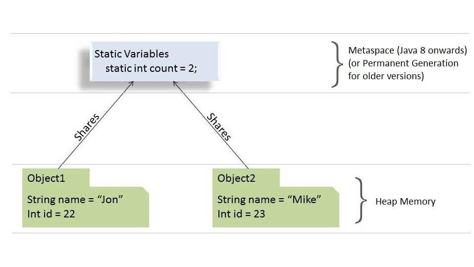

## access modifiers

|  Modifier   | Class | Package | Subclass | World |
| :---------: | :---: | :-----: | :------: | :---: |
|  `public`   |   Y   |    Y    |    Y     |   Y   |
| `protected` |   Y   |    Y    |    Y     |   N   |
|  `default`  |   Y   |    Y    |    N     |   N   |
|  `private`  |   Y   |    N    |    N     |   N   |

### **Instance and Class Variables**

Here's a summary of the type promotion rules that apply for method overloading:

- *byte* can be promoted to *short, int, long, float,* or *double*
- *short* can be promoted to *int, long, float,* or *double*
- *char* can be promoted to *int, long, float,* or *double*
- *int* can be promoted to *long, float,* or *double*
- *long* can be promoted to *float* or *double*
- *float* can be promoted to *double*

### **Compelling Reasons to Use \*static\* Fields**

- When the value of variable is independent of objects
- When the value is supposed to be shared across all objects

### **Key Points to Remember**

- Since *static* variables belong to a class, they can be accessed directly using class name and don't need any object reference
- *static* variables can only be declared at the class level
- *static* fields can be accessed without object initialization
- Although we can access *static* fields using an object reference (like *ford.numberOfCars++*) , we should refrain from using it as in this case it becomes difficult to figure whether it’s an instance variable or a class variable; instead, we should always refer to *static* variables using class name (for example, in this case, *Car.numberOfCars++*)

### **Compelling Reasons to Use \*static\* Methods**

- To access/manipulate static variables and other static methods that don't depend upon objects
- *static* methods are widely used in utility and helper classes

### **Key Points to Remember**

- *static* methods in Java are resolved at compile time. Since method overriding is part of Runtime Polymorphism, **so static methods can't be overridden**
- abstract methods can't be static
- *static* methods cannot use *this* or *super* keywords
- The following combinations of the instance, class methods and variables are valid:
  1. Instance methods can directly access both instance methods and instance variables
  2. Instance methods can also access *static* variables and *static* methods directly
  3. *static* methods can access all *static* variables and other *static* methods
  4. ***static\* methods cannot access instance variables and instance methods directly**; they need some object reference to do so