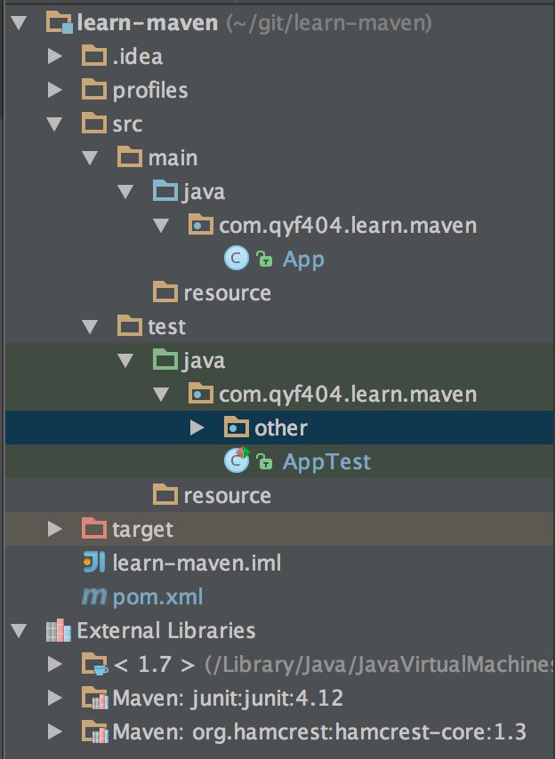
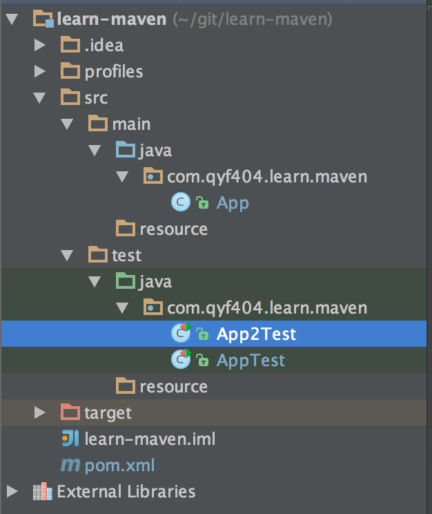
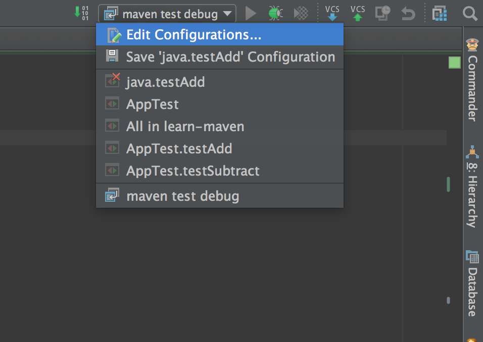
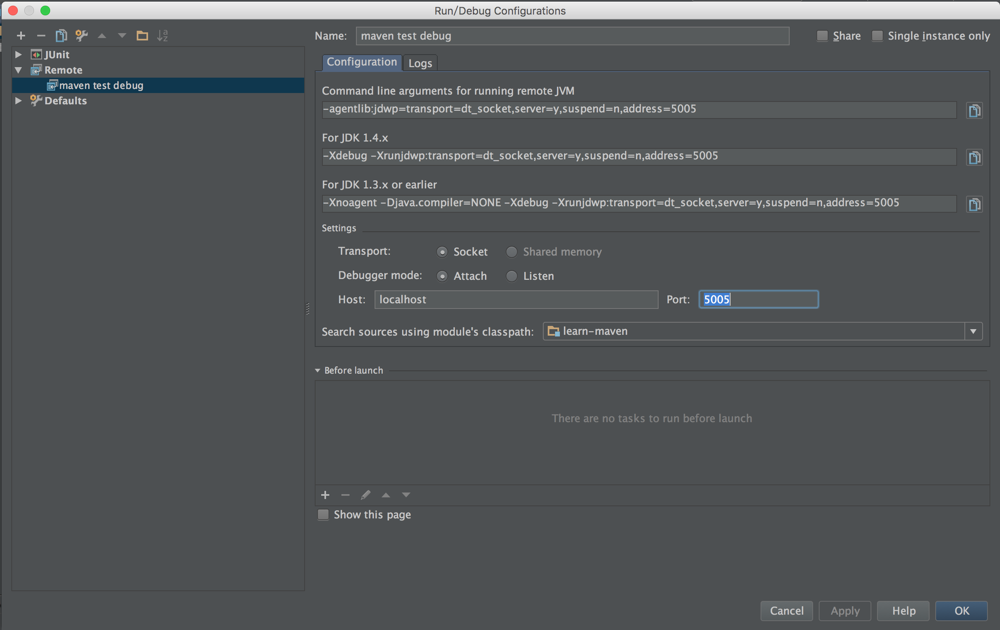
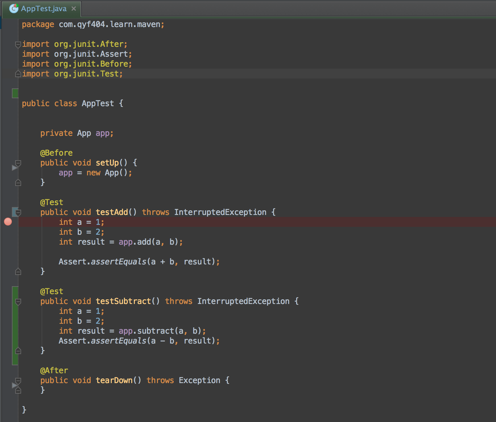
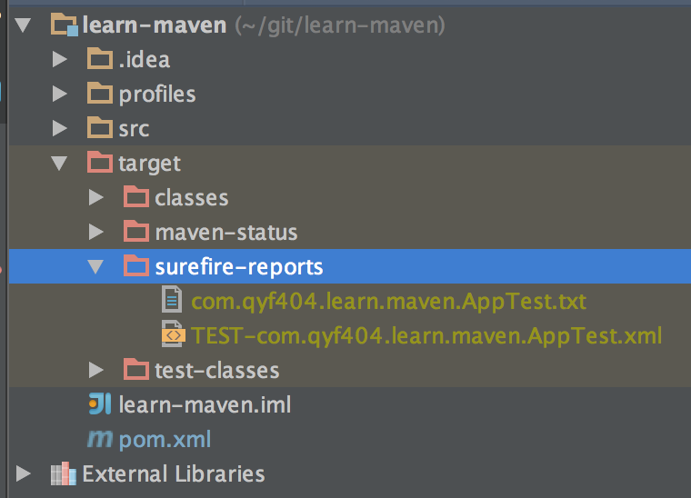
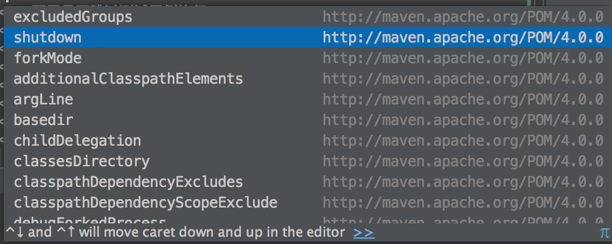

------

# 1.maven-surefire-plugin是个什么鬼？

如果你执行过`mvn test`或者执行其他maven命令时跑了测试用例，你就已经用过`maven-surefire-plugin`了。`maven-surefire-plugin`是maven里执行测试用例的插件，不显示配置就会用默认配置。这个插件的`surefire:test`命令会默认绑定maven执行的`test`阶段。

> maven的生命周期有哪些阶段？
>
> [validate, initialize, generate-sources, process-sources, generate-resources, process-resources, compile, process-classes, generate-test-sources, process-test-sources, generate-test-resources, process-test-resources, test-compile, process-test-classes, **`test`**, prepare-package, package, pre-integration-test, integration-test, post-integration-test, verify, install, deploy]

------

# 2.maven-surefire-plugin的使用

如果说maven已经有了maven-surefire-plugin的默认配置，我们还有必要了解maven-surefire-plugin的配置么？答案是肯定的。虽说maven-surefire-plugin有默认配置，但是当需要修改一些测试执行的策略时，就有必要我们去重新配置这个插件了。

## 2.1.配置JUnit

### 2.1.1.插件自动匹配

最简单的配置方式就不配置或者是只声明插件。

```xml
<plugin>
	<groupId>org.apache.maven.plugins</groupId>
	<artifactId>maven-surefire-plugin</artifactId>
	<version>2.19</version>
</plugin>
```

这个时候maven-surefire-plugin会按照如下逻辑去寻找JUnit的版本并执行测试用例。

```
if the JUnit version in the project >= 4.7 and the parallel attribute has ANY value
	use junit47 provider
if JUnit >= 4.0 is present
	use junit4 provider
else
	use junit3.8.1
```

### 2.1.2.插件手动匹配

当然，如果你明确用的是JUnit4.7及以上版本，可以明确声明：

```xml
<plugin>
	<groupId>org.apache.maven.plugins</groupId>
	<artifactId>maven-surefire-plugin</artifactId>
	<version>2.19</version>
	<dependencies>
		<dependency>
			<groupId>org.apache.maven.surefire</groupId>
			<artifactId>surefire-junit47</artifactId>
			<version>2.19</version>
		</dependency>
	</dependencies>
</plugin>
```

JUnit4.0(含)到JUnit4.7(不含)的版本，这样声明:

```xml
<plugin>
	<groupId>org.apache.maven.plugins</groupId>
	<artifactId>maven-surefire-plugin</artifactId>
	<version>2.19</version>
	<dependencies>
		<dependency>
			<groupId>org.apache.maven.surefire</groupId>
			<artifactId>surefire-junit4</artifactId>
			<version>2.19</version>
		</dependency>
	</dependencies>
</plugin>
```

JUnit3.8(含)到JUnit4.0(不含)的版本，这样声明:

```xml
<plugin>
	<groupId>org.apache.maven.plugins</groupId>
	<artifactId>maven-surefire-plugin</artifactId>
	<version>2.19</version>
	<dependencies>
		<dependency>
			<groupId>org.apache.maven.surefire</groupId>
			<artifactId>surefire-junit3</artifactId>
			<version>2.19</version>
		</dependency>
	</dependencies>
</plugin>
```

JUnit3.8以下的版本surefire不支持。建议大家用最新的JUnit版本，目前是4.12.

```xml
<dependencies>
	[...]
    <dependency>
        <groupId>junit</groupId>
        <artifactId>junit</artifactId>
        <version>4.12</version>
        <scope>test</scope>
    </dependency>
	[...]        
</dependencies>
```

本文的例子我们用的Junit4.12.

## 2.2.准备测试用例

我们现在准备两个类,一个被测试的类,一个测试用例.目录结构如下



现在我们准备一个简单的类.

```java
package com.qyf404.learn.maven;

public class App {
    public int add(int a, int b) {
        return a + b;
    }
    public int subtract(int a, int b) {
        return a - b;
    }
}
```

再创建一个测试用例.

```java
package com.qyf404.learn.maven;

import org.junit.After;
import org.junit.Assert;
import org.junit.Before;
import org.junit.Test;

public class AppTest {
    private App app;
    @Before
    public void setUp() {
        app = new App();
    }
    @Test
    public void testAdd() throws InterruptedException {
        int a = 1;
        int b = 2;
        int result = app.add(a, b);
        Assert.assertEquals(a + b, result);
    }
    @Test
    public void testSubtract() throws InterruptedException {
        int a = 1;
        int b = 2;
        int result = app.subtract(a, b);
        Assert.assertEquals(a - b, result);
    }
    @After
    public void tearDown() throws Exception {
    }
}
```

## 2.3.用maven执行测试用例

用maven执行测试用例很简单,直接运行`mvn test`就可以.一般我们执行maven打包命令`mvn package`前maven会默认执行`test`命令.

```bash
qyfmac$ mvn test
[INFO] Scanning for projects...
[INFO]                                                                         
[INFO] ------------------------------------------------------------------------
[INFO] Building learn-maven 1.0-SNAPSHOT
[INFO] ------------------------------------------------------------------------
[INFO] 
[INFO] --- maven-resources-plugin:2.6:resources (default-resources) @ learn-maven ---
[WARNING] Using platform encoding (UTF-8 actually) to copy filtered resources, i.e. build is platform dependent!
[INFO] skip non existing resourceDirectory /Users/qyfmac/git/learn-maven/src/main/resources
[INFO] 
[INFO] --- maven-compiler-plugin:3.1:compile (default-compile) @ learn-maven ---
[INFO] Changes detected - recompiling the module!
[WARNING] File encoding has not been set, using platform encoding UTF-8, i.e. build is platform dependent!
[INFO] Compiling 1 source file to /Users/qyfmac/git/learn-maven/target/classes
[INFO] 
[INFO] --- maven-resources-plugin:2.6:testResources (default-testResources) @ learn-maven ---
[WARNING] Using platform encoding (UTF-8 actually) to copy filtered resources, i.e. build is platform dependent!
[INFO] skip non existing resourceDirectory /Users/qyfmac/git/learn-maven/src/test/resources
[INFO] 
[INFO] --- maven-compiler-plugin:3.1:testCompile (default-testCompile) @ learn-maven ---
[INFO] Changes detected - recompiling the module!
[WARNING] File encoding has not been set, using platform encoding UTF-8, i.e. build is platform dependent!
[INFO] Compiling 2 source files to /Users/qyfmac/git/learn-maven/target/test-classes
[INFO] 
[INFO] --- maven-surefire-plugin:2.19:test (default-test) @ learn-maven ---
[WARNING] The parameter forkMode is deprecated since version 2.14. Use forkCount and reuseForks instead.
[INFO] Surefire report directory: /Users/qyfmac/git/learn-maven/target/surefire-reports
[INFO] Using configured provider org.apache.maven.surefire.junit4.JUnit4Provider

-------------------------------------------------------
 T E S T S
-------------------------------------------------------
Running com.qyf404.learn.maven.AppTest
Tests run: 2, Failures: 0, Errors: 0, Skipped: 0, Time elapsed: 0.003 sec - in com.qyf404.learn.maven.AppTest

Results :

Tests run: 2, Failures: 0, Errors: 0, Skipped: 0

[INFO] ------------------------------------------------------------------------
[INFO] BUILD SUCCESS
[INFO] ------------------------------------------------------------------------
[INFO] Total time: 2.622 s
[INFO] Finished at: 2015-12-01T11:36:04+08:00
[INFO] Final Memory: 14M/228M
[INFO] ------------------------------------------------------------------------
qyfmac$ 
```

其实我们会发现关键内容还是JUnit的东西,maven只是作为一个调用器调用了一下这些测试用例.

# 3.进阶

后面让我们来研究一下`maven-surefire-plugin`这个插件更多的知识,这些多数都是和配置相关的.

## 3.1.跳过测试用例

在工作中,很多情况下我们打包是不想执行测试用例的,可能是测试用例不完事,或是测试用例会影响数据库数据.跳过测试用例执行过程有三个种方法.

### 3.1.1.在configuration中声明

在插件的configuration配置中声明跳过测试用例

```xml
<plugin>
    <groupId>org.apache.maven.plugins</groupId>
    <artifactId>maven-surefire-plugin</artifactId>
    <version>2.19</version>
    <dependencies>
        <dependency>
            <groupId>org.apache.maven.surefire</groupId>
            <artifactId>surefire-junit47</artifactId>
            <version>2.19</version>
        </dependency>
    </dependencies>
    <configuration>
        <skipTests>true</skipTests>
    </configuration>
</plugin>
```

### 3.1.2.在properties中声明

在properties配置中声明跳过测试用例

```xml
<properties>
    <maven.test.skip>true</maven.test.skip>
</properties>
```

或

```xml
<properties>
    <skipTests>true</skipTests>
</properties>
```

### 3.1.3.在执行命令中声明

在执行maven命令时可以声明跳过测试用例

```bash
qyfmac$ mvn test -Dmaven.test.skip=true
```

或

```bash
qyfmac$ mvn test -DskipTests=true
```

### 3.1.4.跳过测试用例优先级排序

首先分两种情况,一种是配置`skipTests`,一种是配置`maven.test.skip`(真要命,声明位置就三处了,还搞出两个变量名,一共就是5中情况).

- 如果是配置`skipTests`, configuration的配置优先级最高,命令中得配置次之, properties的配置最低.
- 即`configuration > 命令 > properties`
- 如果是配置`maven.test.skip`,命令中得配置优先级最高, properties的配置最低.
  即`命令 > properties`
- `skipTests`和`maven.test.skip`有一个被设置成了true,则跳过测试用例.
  即`skipTests||maven.test.skip`决定是否跳过测试用例执行.

## 3.2.maven命令执行一个测试用例

很多情况下我们写完一个测试用例后,想马上运行一下,看看执行情况.如果用IDE开发,里面一般都有直接运行一个测试用例的方法.但是如果用maven命令达到同样的效果,就需要加些命令参数了.

比如我们现在再加一个测试用例App2Test.java.



```java
package com.qyf404.learn.maven;

import org.junit.After;
import org.junit.Assert;
import org.junit.Before;
import org.junit.Test;
import org.junit.runner.RunWith;
import org.junit.runners.JUnit4;

@RunWith(JUnit4.class)
public class App2Test {
    private App app;
    @Before
    public void setUp() {
        app = new App();
    }
    @Test
    public void testAdd() throws InterruptedException {
        int a = 1;
        int b = 2;
        int result = app.add(a, b);
        Thread.currentThread().sleep(1000);
        Assert.assertEquals(a + b, result);
    }
    @After
    public void tearDown() throws Exception {
    }

}
```

直接运行 mvn test是这样的,它执行了全部测试用例.

```bash
qyfmac$ mvn test
[INFO] Scanning for projects...
[INFO]                                                                         
[INFO] ------------------------------------------------------------------------
[INFO] Building learn-maven 1.0-SNAPSHOT
[INFO] ------------------------------------------------------------------------

...

-------------------------------------------------------
 T E S T S
-------------------------------------------------------
Running com.qyf404.learn.maven.App2Test
Tests run: 1, Failures: 0, Errors: 0, Skipped: 0, Time elapsed: 1.004 sec - in com.qyf404.learn.maven.App2Test
Running com.qyf404.learn.maven.AppTest
Tests run: 2, Failures: 0, Errors: 0, Skipped: 0, Time elapsed: 0 sec - in com.qyf404.learn.maven.AppTest

Results :

Tests run: 3, Failures: 0, Errors: 0, Skipped: 0

[INFO] ------------------------------------------------------------------------
[INFO] BUILD SUCCESS
[INFO] ------------------------------------------------------------------------
[INFO] Total time: 2.773 s
[INFO] Finished at: 2015-12-01T14:57:00+08:00
[INFO] Final Memory: 9M/156M
[INFO] ------------------------------------------------------------------------
```

现在我们用命令`mvn test -Dtest=App2Test`指定执行App2Test.

```bash
qyfmac$ mvn test -Dtest=App2Test
[INFO] Scanning for projects...
[INFO]                                                                         
[INFO] ------------------------------------------------------------------------
[INFO] Building learn-maven 1.0-SNAPSHOT
[INFO] ------------------------------------------------------------------------

...

-------------------------------------------------------
 T E S T S
-------------------------------------------------------
Running com.qyf404.learn.maven.App2Test
Tests run: 1, Failures: 0, Errors: 0, Skipped: 0, Time elapsed: 1.003 sec - in com.qyf404.learn.maven.App2Test

Results :

Tests run: 1, Failures: 0, Errors: 0, Skipped: 0

[INFO] ------------------------------------------------------------------------
[INFO] BUILD SUCCESS
[INFO] ------------------------------------------------------------------------
[INFO] Total time: 3.061 s
[INFO] Finished at: 2015-12-01T14:58:59+08:00
[INFO] Final Memory: 9M/156M
[INFO] ------------------------------------------------------------------------
```

`-Dtest`的参数是可以用表达式的.

- 比如执行多个测试用例可以用逗号分开 `mvn test -Dtest=App2Test,AppTest`.
- 也可以用ant风格的路径表达式`mvn test -Dtest=*2Test`,`mvn test -Dtest=???2Test`.
- 甚至指定具体的测试方法`mvn test -Dtest=*Test#testAdd`.
- 指定具体包里的测试用例`mvn test -Dtest=com/qyf404/learn/maven/*`.

## 3.3.测试用例的包含与例外配置

上面说了,在执行命令时可以指定执行哪个或哪些测试用例,其实在pom.xml里也是可以配置的.
比如打包时执行测试用例AppTest,不执行App2Test,可以这么配置.

```xml
<plugin>
    <groupId>org.apache.maven.plugins</groupId>
    <artifactId>maven-surefire-plugin</artifactId>
    <version>2.19</version>
    <dependencies>
        <dependency>
            <groupId>org.apache.maven.surefire</groupId>
            <artifactId>surefire-junit47</artifactId>
            <version>2.19</version>
        </dependency>
    </dependencies>
    <configuration>
        <!--配置是否跳过测试用例执行-->
        <!--<skipTests>true</skipTests>-->
        <includes>
            <include>**/AppTest.java</include>
        </includes>
        <excludes>
            <exclude>**/App2Test.java</exclude>
        </excludes>
    </configuration>
</plugin>
```

`<include>`和`<exclude>`里的配置方式和`-Dtest`后面的一样可以配置表达式:

- 指定具体类`<include>AppTest</include>`.
- 指定具体类`<include>AppTest.java</include>`.
- 指定具体类`<include>AppTest.class</include>`.
- 指定具体类`<include>com/qyf404/learn/maven/AppTest.class</include>`.
- 指定具体类`<include>com/qyf404/learn/maven/AppTest.class,App2Test</include>`.
- 叹号[!]表示否定`<include>!*2Test.class</include>`.
- 使用ant风格的路径表达式`<include>**/*Test</include>`.
- 使用ant风格的路径表达式`<include>**/???Test</include>`.
- 更复杂的`%regex[expr]`表达式`<include>%regex[com.qyf404.learn.maven.*Test.class]</include>`.
- 更复杂的`%regex[expr]`表达式`<include>%regex[com.qyf404.*.*Test.class]</include>`.
- 更复杂的`%regex[expr]`表达式`<include>%regex[com.qyf404.[learn|test].*Test.class]</include>`,中间的方括号表示或的概念,即learn或test的情况.
- 更复杂的`%regex[expr]`表达式`<include>!%regex[com.qyf404.*.*2Test.class]</include>`,这里面的叹号表示否定,即包含不符合该表达式的测试用例.
- 更复杂的`%regex[expr]`表达式`<include>%regex[.*2Test.class]</include>`,这种配置方式忽略了包前缀,可以理解成倒着匹配全类名.
- 更复杂的`%regex[expr]`表达式里最好不要有问号[?],而且匹配的是类的全类名.
- *不可以指定具体方法,这种配置是错误的`<include>\*Test#testAdd</include>`*.
- *不可以指定java文件在`%regex[expr]`里具体方法,这种配置是错误的`<include>%regex[com.qyf404.learn.maven.\*Test.java]</include>`*.
- 如果同时配置了`<include>`和`<exclude>`,最终执行的测试用例是二者的交集.

## 3.4.分组执行测试用例

上面我们说了,可以配置`<include>`这些信息来控制执行哪些测试用例,但是JUnit里有个注解`@Category`可以对测试用例组分组标记,而用maven执行测试用例时,我们也可以根据这个注解的标记,来确定执行哪组测试用例.

比如我们的测试用例是这样的:

```java
package com.qyf404.learn.maven;

import org.junit.After;
import org.junit.Assert;
import org.junit.Before;
import org.junit.Test;
import org.junit.experimental.categories.Category;


public class AppTest {
    private App app;
    @Before
    public void setUp() {
        app = new App();
    }
    @Test
    @Category(com.qyf404.learn.maven.FastTests.class)
    public void testAdd() throws InterruptedException {
        int a = 1;
        int b = 2;
        int result = app.add(a, b);
        System.out.println("---" + Thread.currentThread().getName());
        Assert.assertEquals(a + b, result);
    }
    @Test()
    @Category(com.qyf404.learn.maven.SlowTests.class)
    public void testSubtract() throws InterruptedException {
        int a = 1;
        int b = 2;
        int result = app.subtract(a, b);
        System.out.println("---" + Thread.currentThread().getName());
        Assert.assertEquals(a - b, result);
    }
    @After
    public void tearDown() throws Exception {
    }

}
```

pom.xml里这么配置:

```xml
<plugin>
    <groupId>org.apache.maven.plugins</groupId>
    <artifactId>maven-surefire-plugin</artifactId>
    <version>2.19</version>
    <configuration>
        <groups>com.qyf404.learn.maven.SlowTests</groups>
    </configuration>
</plugin>
```

在执行`mvn test`时,则只执行标记`@Category(com.qyf404.learn.maven.SlowTests.class)`的测试用例.

## 3.5.若有测试执行失败则跳过其他测试

在打包时,默认情况会执行全部测试用例,然后给出一个执行的统计结果,如下所示:

```bash
Results :

Tests run: 3, Failures: 1, Errors: 0, Skipped: 0
```

很多情况下我们希望测试用例没有失败的才能打包,如果出现打包失败,需要立刻停止执行其他测试用例.为满足这个要求,我们需要增加一些配置设定.

```xml
<configuration>
    <skipAfterFailureCount>1</skipAfterFailureCount>
</configuration>
```

里面的数字`1`表示当有一个测试用例执行失败或发生异常时,跳过后续的其他测试用例.这个数字其实只要是一个大于零的数就可以.表达的意思就是当有`N`个测试用例执行失败或异常时,跳过后续的其他测试用例.

## 3.6.重新运行失败的测试用例

当我们的一个测试用例测试的是一个远程服务,在某些情况下可能由于环境问题(比如网络)导致测试用例执行失败,但这并不是程序问题.换句话说,当一个测试用例执行N次,有一次执行成功就认为成功.这个时候我们就需要配置一个参数,运行执行失败的此时用例重新执行.

```xml
<configuration>
    <rerunFailingTestsCount>2</rerunFailingTestsCount>
</configuration>
```

里面的数字`2`表示当某个测试用例执行失败以后,还可以重新执行2次,有一次执行成功就认为测试用例执行成功.里面的`2`只要是一个大于零的整数就可以,表示重试次数.如果发生重试,在maven的执行报告中会多一个Flakes.

```bash
-------------------------------------------------------
 T E S T S
-------------------------------------------------------
Running com.qyf404.learn.maven.App2Test
Tests run: 3, Failures: 2, Errors: 0, Skipped: 0, Time elapsed: 3.023 sec <<< FAILURE! - in com.qyf404.learn.maven.App2Test
testAdd(com.qyf404.learn.maven.App2Test)  Time elapsed: 1.012 sec  <<< FAILURE!
java.lang.AssertionError: expected:<2> but was:<3>
        at com.qyf404.learn.maven.App2Test.testAdd(App2Test.java:32)

testAdd(com.qyf404.learn.maven.App2Test)  Time elapsed: 1.006 sec  <<< FAILURE!
java.lang.AssertionError: expected:<2> but was:<3>
        at com.qyf404.learn.maven.App2Test.testAdd(App2Test.java:32)

Running com.qyf404.learn.maven.AppTest
Tests run: 2, Failures: 0, Errors: 0, Skipped: 0, Time elapsed: 0 sec - in com.qyf404.learn.maven.AppTest

Results :

Flaked tests: 
com.qyf404.learn.maven.App2Test.testAdd(com.qyf404.learn.maven.App2Test)
  Run 1: App2Test.testAdd:32 expected:<2> but was:<3>
  Run 2: App2Test.testAdd:32 expected:<2> but was:<3>
  Run 3: PASS


Tests run: 3, Failures: 0, Errors: 0, Skipped: 0, Flakes: 1
```

## 3.7.Debugging Tests

一般情况我们可以在IDE中直接执行测试用例,有时候会出现这种情况,IED中直接执行测试用例是没问题的,但是用maven命令打包时就执行失败了.我们可以在命令中加入`-X`或`--debug`来打印更多的日志信息来排查问题.但也可以开启JVM的调试端口来远程debug.

### 3.7.1.以调试模式执行maven命令

执行maven命令`mvn -Dmaven.surefire.debug test`以开启调试模式.当然也可以用完整的命令来指定端口

```bash
mvn -Dmaven.surefire.debug="-Xdebug -Xrunjdwp:transport=dt_socket,server=y,suspend=y,address=5005 -Xnoagent -Djava.compiler=NONE" test
```

命令执行后是这个样子:

```bash
qyfmac$ mvn -Dmaven.surefire.debug test
[INFO] Scanning for projects...
[INFO]                                                                         
[INFO] ------------------------------------------------------------------------
[INFO] Building learn-maven 1.0-SNAPSHOT
[INFO] ------------------------------------------------------------------------
[INFO] 
[INFO] --- maven-resources-plugin:2.6:resources (default-resources) @ learn-maven ---
[WARNING] Using platform encoding (UTF-8 actually) to copy filtered resources, i.e. build is platform dependent!
[INFO] skip non existing resourceDirectory /Users/qyfmac/git/learn-maven/src/main/resources
[INFO] 
[INFO] --- maven-compiler-plugin:3.1:compile (default-compile) @ learn-maven ---
[INFO] Nothing to compile - all classes are up to date
[INFO] 
[INFO] --- maven-resources-plugin:2.6:testResources (default-testResources) @ learn-maven ---
[WARNING] Using platform encoding (UTF-8 actually) to copy filtered resources, i.e. build is platform dependent!
[INFO] skip non existing resourceDirectory /Users/qyfmac/git/learn-maven/src/test/resources
[INFO] 
[INFO] --- maven-compiler-plugin:3.1:testCompile (default-testCompile) @ learn-maven ---
[INFO] Nothing to compile - all classes are up to date
[INFO] 
[INFO] --- maven-surefire-plugin:2.19:test (default-test) @ learn-maven ---

-------------------------------------------------------
 T E S T S
-------------------------------------------------------
Listening for transport dt_socket at address: 5005
```

后面我们就需要根据这个`5005`端口去启动本地源码了.

### 3.7.2.使用IDE远程调试

开始调试前需要先配置IDE,我以idea为例说明如何配置.

1. 在右上角选择`Edit Configurations...`.
   
2. 在打开的对话框中选择左上角的加号,然后选择`Remote`.
   
3. 配置远程调试的参数,主要就是改个名字和端口,其他的配置一般不需要修改.设定好后点保存.
   
4. 在要debug得测试用例上设置一个断点.
   
5. 选择刚才设置好的配置启动远程调试.
   
6. 开始debug你的程序吧.
   

## 3.8.并发执行测试用例

如果测试用例很多,而且并行执行时不会互相影响,这时我们可以配置一个线程数来加快测试用例的执行效率.

```xml
<plugin>
	<groupId>org.apache.maven.plugins</groupId>
	<artifactId>maven-surefire-plugin</artifactId>
	<version>2.19</version>
	<configuration>
		<parallel>methods</parallel>
		<threadCount>10</threadCount>
	</configuration>
</plugin>
```

## 3.9.查看测试报告

在执行完`mvn test`后,会在`target`目录下生成测试报告
一共两个文件,txt文件记录了汇总信息,xml文件里记录了测试用例执行的环境和执行情况,而且方便程序解析展现.

txt文件内容:

```bash
-------------------------------------------------------------------------------
Test set: com.qyf404.learn.maven.AppTest
-------------------------------------------------------------------------------
Tests run: 1, Failures: 0, Errors: 0, Skipped: 0, Time elapsed: 0.001 sec - in com.qyf404.learn.maven.AppTest
```

xml文件内容:

```xml
<?xml version="1.0" encoding="UTF-8"?>
<testsuite xmlns:xsi="http://www.w3.org/2001/XMLSchema-instance" xsi:schemaLocation="https://maven.apache.org/surefire/maven-surefire-plugin/xsd/surefire-test-report.xsd" name="com.qyf404.learn.maven.AppTest" time="0.001" tests="1" errors="0" skipped="0" failures="0">
  <properties>
    <property name="java.runtime.name" value="Java(TM) SE Runtime Environment"/>
    <property name="sun.boot.library.path" value="/Library/Java/JavaVirtualMachines/jdk1.7.0_75.jdk/Contents/Home/jre/lib"/>
    <property name="java.vm.version" value="24.75-b04"/>
    <property name="gopherProxySet" value="false"/>
    ...
  </properties>
  <testcase name="testAdd" classname="com.qyf404.learn.maven.AppTest" time="0.001"/>
</testsuite>
```

# 结语

写了这么多,基本上把`maven-surefire-plugin`这个插件常用的都介绍了.但是`maven-surefire-plugin`没介绍的远比这些多,看看它的配置项就知道了.



再加上依据测试结果展现的测试报告就更多了.如果想更加深入了解可以到[官网](http://maven.apache.org/surefire/maven-surefire-plugin)学习.

示例代码github地址: https://github.com/qyf404/learn-maven/tree/maven-surefire-plugin.

# 参考

- http://maven.apache.org/surefire/maven-surefire-plugin
